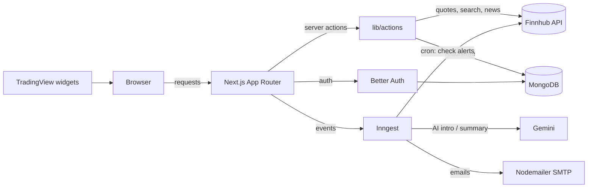

# MarkGauge

Personal equity monitoring workspace — live quotes, watchlists, and price
alerts in one calm place. MarkGauge lets retail investors track the symbols
they care about, set upper/lower price alerts, and receive AI-personalized
emails, without juggling a dozen browser tabs.

> Informational only. MarkGauge is not a brokerage and does not provide
> buy/sell advice.

---

## Features

- **Authentication** — email/password auth via Better Auth with protected routes.
- **Market dashboard** — TradingView market overview, heatmap, top stories, and quotes.
- **Symbol search** — fast Cmd/Ctrl+K search backed by Finnhub.
- **Stock detail** — interactive charts, technicals, company profile, and financials.
- **Watchlist** — add/remove symbols with live price, change %, market cap, and P/E.
- **Price alerts** — create upper/lower threshold alerts and manage them inline.
- **Background jobs** — scheduled alert checks, price-alert emails, and a daily AI market brief.
- **Personalized email** — Gemini generates a tailored welcome note and news summaries.

---

## Tech stack

| Layer | Technology |
|-------|-----------|
| Framework | Next.js 15 (App Router, Turbopack) |
| Language | TypeScript |
| Styling | Tailwind CSS 4, shadcn/ui, Radix UI |
| Auth | Better Auth (MongoDB adapter) |
| Database | MongoDB + Mongoose |
| Market data | Finnhub REST API |
| Charts | TradingView embed widgets |
| Background jobs | Inngest |
| AI | Google Gemini (via Inngest `step.ai`) |
| Email | Nodemailer (SMTP / Gmail) |
| Testing | Vitest |

---

## Architecture



See [`docs/architecture`](docs/architecture/README.md) for data flows, folder
structure, and the background-jobs design.

---

## Prerequisites

- Node.js 20.17+ (recommended)
- npm 10+
- MongoDB Atlas cluster or local MongoDB instance
- API keys: Finnhub, Better Auth secret, Gemini, SMTP credentials, Inngest

---

## Quick start

```bash
# 1. Install dependencies
npm install

# 2. Copy the environment template
cp .env.example .env.local

# 3. Fill in .env.local (see Environment variables below)

# 4. Run the development server
npm run dev
```

Open [http://localhost:3000](http://localhost:3000).

For background jobs, run the Inngest dev server in a second terminal:

```bash
npx inngest-cli@latest dev
```

Optionally seed sample watchlist/alert data:

```bash
npm run db:seed
```

---

## Scripts

| Command | Description |
|---------|-------------|
| `npm run dev` | Start the Next.js dev server (Turbopack) |
| `npm run build` | Production build |
| `npm run start` | Start the production server |
| `npm run lint` | Run ESLint |
| `npm run typecheck` | Type-check with `tsc --noEmit` |
| `npm test` | Run the Vitest suite |
| `npm run db:seed` | Seed sample watchlist and alert documents |

---

## Environment variables

Copy `.env.example` to `.env.local` and configure:

| Variable | Required | Description |
|----------|----------|-------------|
| `NEXT_PUBLIC_BASE_URL` | Yes | App URL (`http://localhost:3000` in dev) |
| `MONGODB_URI` | Yes | MongoDB connection string |
| `BETTER_AUTH_SECRET` | Yes | Random secret for session signing |
| `BETTER_AUTH_URL` | Yes | Same as base URL in dev |
| `FINNHUB_API_KEY` | Yes | Finnhub API key (server-side) |
| `NEXT_PUBLIC_FINNHUB_API_KEY` | Yes | Finnhub API key (client-visible) |
| `FINNHUB_BASE_URL` | Yes | `https://finnhub.io/api/v1` |
| `NODEMAILER_EMAIL` | Yes | SMTP sender email |
| `NODEMAILER_PASSWORD` | Yes | SMTP password or app password |
| `GEMINI_API_KEY` | Yes | AI-personalized email content |
| `INNGEST_EVENT_KEY` | For jobs | Inngest event key |
| `INNGEST_SIGNING_KEY` | For jobs | Inngest webhook signing key |

---

## API endpoints

| Method | Route | Description |
|--------|-------|-------------|
| `GET/POST` | `/api/auth/[...all]` | Better Auth handler (sign in/up/out, session) |
| `GET` | `/api/health/db` | Database health check (`200` ok / `503` down) |
| `GET` | `/api/alerts` | List active alerts |
| `POST` | `/api/trigger-alert` | Queue an `alert/price.triggered` event |
| `GET/POST/PUT` | `/api/inngest` | Inngest serve endpoint for background functions |

Background functions registered with Inngest:

- `sign-up-email` — welcome email on registration (`app/user.created`)
- `daily-news-summary` — cron `0 12 * * *`, AI market brief
- `send-price-alert` — sends an alert email (`alert/price.triggered`)
- `check-price-alerts` — cron `*/5 * * * *`, scans thresholds and emits events

---

## Project structure

```
app/           # Next.js App Router pages and API routes
components/    # UI components (shadcn/ui + feature components)
database/      # Mongoose connection, models, and seed
hooks/         # Client React hooks
lib/           # Server actions, auth, integrations (Finnhub, Inngest, mail)
tests/         # Vitest unit tests
docs/          # Product, requirements, architecture, and operations docs
types/         # Shared TypeScript declarations
```

---

## Documentation

- [Discovery](docs/discovery/README.md) — problem, vision, personas, scope
- [Requirements](docs/requirements/README.md) — flows, functional specs, checklist
- [Architecture](docs/architecture/README.md) — stack, data flows, folder layout
- [Deployment guide](docs/operations/deployment-guide.md) — production setup
- [QA checklist](docs/operations/qa-checklist.md) — release verification
- [Contributing](CONTRIBUTING.md) — workflow and conventions

---

## Deployment

MarkGauge deploys cleanly to Vercel. See the
[deployment guide](docs/operations/deployment-guide.md) for environment setup,
Inngest registration, and a production smoke test.

---

## Acknowledgments

- Market data by [Finnhub](https://finnhub.io).
- Charts by [TradingView](https://www.tradingview.com) embed widgets.
- Background jobs by [Inngest](https://www.inngest.com).
- UI primitives from [Radix UI](https://www.radix-ui.com) and [shadcn/ui](https://ui.shadcn.com).

Project structure and feature set were rebuilt as a learning exercise inspired
by a stock-market monitoring reference application.

---

## License

Released under the [MIT License](LICENSE).
