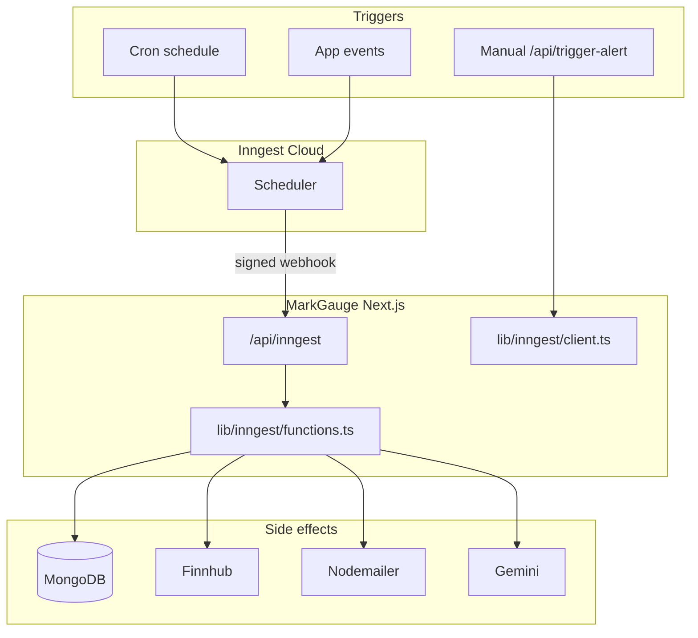
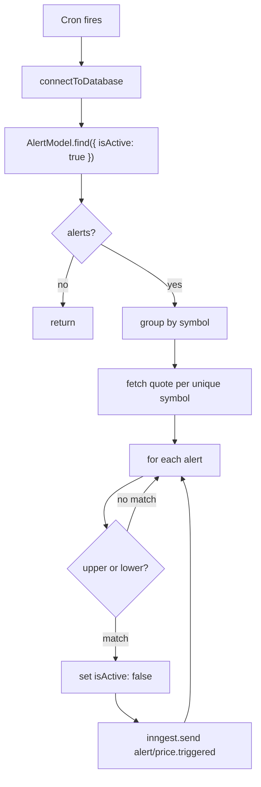
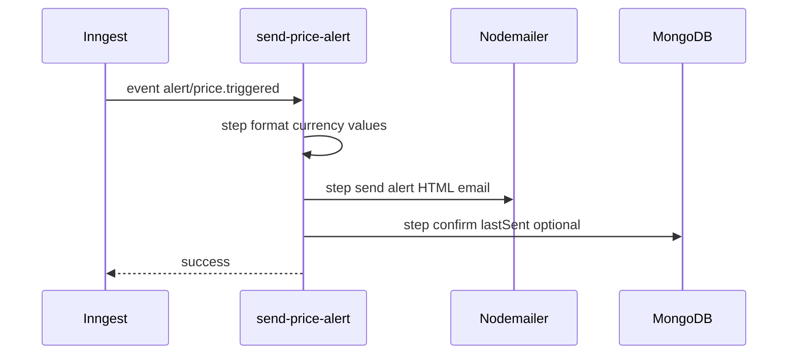

# Background Jobs

Design for scheduled and event-driven work in **MarkGauge** using **Inngest**. Covers alert price evaluation, email delivery, and optional AI-powered digests. Aligns with [data flows](data-flows.md) DF-09–DF-12 and [tech stack](tech-stack.md) decision D7.

---

## Design Goals

| Goal | How Inngest helps |
|------|-------------------|
| Run outside HTTP request | Cron and event functions on platform schedule |
| Survive deploys | Durable steps with retries (NFR-D06) |
| Observable failures | Inngest dashboard + server logs (NFR-O02) |
| Serverless fit | Single `/api/inngest` route on Vercel |
| Idempotent alerts | Deactivate alert before or during email send (NFR-D01) |

v1 uses **polling via cron** for price checks (every 5 minutes), not a persistent WebSocket worker. A separate long-running worker is optional future infrastructure if sub-minute latency becomes a requirement.

---

## Architecture



---

## Inngest Client

**File:** `lib/inngest/client.ts`

```typescript
import { Inngest } from 'inngest';

export const inngest = new Inngest({
  id: 'markgauge',
  ai: {
    gemini: { apiKey: process.env.GEMINI_API_KEY! },
  },
});
```

| Setting | Value |
|---------|-------|
| App ID | `markgauge` — unique Inngest application identifier |
| AI plugin | Gemini for `step.ai.infer` in email/summary functions |

**Environment variables:**

| Variable | Purpose |
|----------|---------|
| `INNGEST_EVENT_KEY` | Send events from app code |
| `INNGEST_SIGNING_KEY` | Verify incoming webhooks (NFR-S07) |

---

## Route Handler

**File:** `app/api/inngest/route.ts`

Registers all functions with Inngest's Next.js adapter:

```typescript
import { serve } from 'inngest/next';
import { inngest } from '@/lib/inngest/client';
import {
  checkPriceAlerts,
  sendPriceAlertEmail,
  sendSignUpEmail,
  sendDailyNewsSummary,
} from '@/lib/inngest/functions';

export const { GET, POST, PUT } = serve({
  client: inngest,
  functions: [
    checkPriceAlerts,
    sendPriceAlertEmail,
    sendSignUpEmail,
    sendDailyNewsSummary,
  ],
});
```

Exported HTTP methods allow Inngest Cloud to sync function definitions and invoke runs.

---

## Function Catalog

| Function ID | Trigger | Priority | Purpose |
|-------------|---------|----------|---------|
| `check-price-alerts` | Cron `*/5 * * * *` | P0 | Load active alerts, fetch quotes, emit trigger events |
| `send-price-alert` | Event `alert/price.triggered` | P0 | Format and send alert email; update `lastSent` |
| `sign-up-email` | Event `app/user.created` | P0 | Optional AI intro + welcome email |
| `daily-news-summary` | Cron `0 12 * * *` + event | P1 | Per-user watchlist news digest |

---

## FN-1 — `check-price-alerts` (Cron)

**Trigger:** every 5 minutes (configurable via `ALERT_CHECK_INTERVAL_MINUTES`).



### Pseudologic

```
for each unique symbol in active alerts:
  quote = await getQuote(symbol)  // uses cache

for each alert:
  if quote unavailable: continue

  triggered =
    (alertType === 'upper' && quote.c >= threshold) ||
    (alertType === 'lower' && quote.c <= threshold)

  if triggered:
    await AlertModel.updateOne(
      { _id: alert._id, isActive: true },
      { $set: { isActive: false, lastSent: new Date() } }
    )
    await inngest.send({
      name: 'alert/price.triggered',
      data: { symbol, userEmail, company, alertType, alertName, thresholdValue, currentValue }
    })
```

### Design notes

- **Deactivate before emit** prevents duplicate events if email step retries (NFR-D01).
- **Symbol deduplication** minimizes Finnhub calls (NFR-R05).
- **No trigger on missing quote** (FR-J06).
- Comparison uses latest trade/close field from Finnhub quote response.

### Steps (Inngest `step.run`)

| Step name | Work |
|-----------|------|
| `load-active-alerts` | MongoDB query |
| `fetch-quotes` | Batched Finnhub with cache |
| `evaluate-and-emit` | Rule check + event send per match |

---

## FN-2 — `send-price-alert` (Event)

**Trigger:** event `alert/price.triggered`

**Payload:**

| Field | Type | Description |
|-------|------|-------------|
| `symbol` | string | Ticker |
| `userEmail` | string | Recipient |
| `company` | string | Display name |
| `alertType` | `'upper' \| 'lower'` | Rule direction |
| `alertName` | string | User label |
| `thresholdValue` | number | Target price |
| `currentValue` | number | Price at trigger |



### Steps

1. **`format-price-data`** — `Intl.NumberFormat` USD for email body.
2. **`send-alert-email`** — `sendPriceAlertEmail()` from `lib/nodemailer`.
3. **`update-alert-last-sent`** — optional safety update if deactivate happened in checker.

Retries: Inngest retries failed email step; idempotency relies on `isActive: false` in checker.

---

## FN-3 — `sign-up-email` (Event)

**Trigger:** event `app/user.created` — emitted from `signUpWithEmail` server action after Better Auth creates user.

**Payload:**

| Field | Example |
|-------|---------|
| `email` | user email |
| `name` | full name |
| `country` | `US` |
| `investmentGoals` | `Growth` |
| `riskTolerance` | `Medium` |
| `preferredIndustry` | `Technology` |

### Steps

1. **`generate-welcome-intro`** — `step.ai.infer` with Gemini (`gemini-2.5-flash-lite` or current stable flash model) using prompt from `lib/inngest/prompts.ts` (`PERSONALIZED_WELCOME_EMAIL_PROMPT`).
2. **`send-welcome-email`** — merge AI intro into HTML template; send via Nodemailer.

**Fallback:** If AI fails, use static intro paragraph (FR-I04).

**Alternative:** Send simple welcome email synchronously in server action and skip this function for v1 minimal path — document recommends event-driven path for AI personalization without blocking sign-up response.

---

## FN-4 — `send-daily-news-summary` (Cron + Event)

**Trigger:**

- Cron: `0 12 * * *` (daily 12:00 UTC)
- Manual event: `app/send.daily.news`

**Priority:** P1 (Portfolio Enthusiast persona)

### Steps

1. **`get-all-users`** — users opted in for news email (all users with email in v1).
2. **`fetch-user-news`** — per user, load watchlist symbols → `getNews(symbols)`.
3. **`summarize-news-{email}`** — Gemini inference per user with `NEWS_SUMMARY_EMAIL_PROMPT`.
4. **`send-news-emails`** — batch `sendNewsSummaryEmail`.

Per-user AI steps isolate failures — one user error does not block others.

---

## Event Catalog

| Event name | Producer | Consumer function |
|------------|----------|-------------------|
| `app/user.created` | `auth.actions` sign-up | `sign-up-email` |
| `alert/price.triggered` | `check-price-alerts` or `/api/trigger-alert` | `send-price-alert` |
| `app/send.daily.news` | Admin script / manual | `daily-news-summary` |

### Emitting from application code

```typescript
import { inngest } from '@/lib/inngest/client';

await inngest.send({
  name: 'app/user.created',
  data: { email, name, country, investmentGoals, riskTolerance, preferredIndustry },
});
```

---

## Supporting API Routes

### `/api/trigger-alert` (POST)

Manual and test path to enqueue `alert/price.triggered` without waiting for cron.

| Use case | Caller |
|----------|--------|
| Local smoke test | Developer curl / Postman |
| Integration test | CI script |
| Future worker bridge | Optional external process |

**Body:** same fields as event payload.

**Security (v1):** Restrict to development or protect with shared secret header in production (NFR-S07). Do not expose unauthenticated in public deploy.

### `/api/alerts` (GET)

Returns active alerts for debugging or optional external worker subscription.

| v1 note | Recommendation |
|---------|----------------|
| Reference stack exposed all alerts | Lock down: API key or dev-only in MarkGauge |

Production: disable public GET or require `Authorization` server secret.

---

## Prompts Module

**File:** `lib/inngest/prompts.ts`

| Constant | Used by |
|----------|---------|
| `PERSONALIZED_WELCOME_EMAIL_PROMPT` | `sign-up-email` |
| `NEWS_SUMMARY_EMAIL_PROMPT` | `daily-news-summary` |
| `ALERT_CONTEXT_PROMPT` (optional) | Enriched alert email |

Prompt rules (FR-I02, NFR-L01):

- No buy/sell recommendations
- Reference only provided JSON news/quote data
- Informational tone with disclaimer compatibility

---

## Retry & Failure Policy

| Function | Retry | On permanent failure |
|----------|-------|----------------------|
| `check-price-alerts` | Full run next cron | Log; alerts stay active for next cycle |
| `send-price-alert` | Email step 3–5 times | Log; user may not get email; alert already inactive |
| `sign-up-email` | AI + email steps | User account still created; log welcome failure |
| `daily-news-summary` | Per-step per user | Skip user; continue batch |

Inngest default exponential backoff applies unless overridden in function config.

---

## Local Development

```bash
# Terminal 1 — Next.js
npm run dev

# Terminal 2 — Inngest dev server
npx inngest-cli@latest dev
```

| Step | Action |
|------|--------|
| 1 | Start Next.js on `localhost:3000` |
| 2 | Start Inngest dev — syncs functions from `/api/inngest` |
| 3 | Create alert in UI with threshold near current price |
| 4 | Trigger `check-price-alerts` from Inngest UI or wait for cron |
| 5 | Verify email in SMTP test inbox (Mailtrap, Ethereal, etc.) |

For immediate test without market move: POST to `/api/trigger-alert` with sample payload.

---

## Optional Future: Real-Time Worker

Not in v1 scope. Documented for architectural awareness only.

A separate Node process could subscribe to Finnhub WebSocket trades, fetch `/api/alerts`, and POST `/api/trigger-alert` on tick — lower latency than 5-minute cron.

| Trade-off | Cron (v1) | WebSocket worker |
|-----------|-----------|------------------|
| Ops complexity | Low | Requires always-on process |
| Latency | Up to check interval | Sub-second |
| Cost | Inngest free tier | Extra host |
| Fit | Part-time monitors | Active traders |

MarkGauge v1 non-goals include sub-second tick streaming (NFR in tech stack).

---

## Monitoring Checklist

- [ ] Inngest dashboard shows successful `check-price-alerts` runs
- [ ] Failed runs alert via Inngest notifications
- [ ] Logs include evaluated / triggered / skipped counts (NFR-O02)
- [ ] No duplicate emails for single alert cross
- [ ] Cron interval matches `ALERT_CHECK_INTERVAL_MINUTES`

---

## File Map

| Path | Responsibility |
|------|----------------|
| `lib/inngest/client.ts` | Inngest client + Gemini AI config |
| `lib/inngest/functions.ts` | All function definitions |
| `lib/inngest/prompts.ts` | AI prompt templates |
| `app/api/inngest/route.ts` | Serve handler |
| `app/api/trigger-alert/route.ts` | Manual event enqueue |
| `app/api/alerts/route.ts` | Alert listing (dev/debug) |
| `lib/nodemailer/index.ts` | Email send helpers |
| `lib/nodemailer/templates.ts` | HTML templates |

---

## Related Documents

- [Data flows](data-flows.md)
- [System architecture](system-architecture.md)
- [Folder structure](folder-structure.md)
- [Architecture index](README.md)
- [External services](../requirements/external-services.md)
- [Functional requirements](../requirements/functional-requirements.md)
