# Data Flows

How data moves through **MarkGauge** for user actions, market data reads, watchlist mutations, and alert-triggered email. Complements [system architecture](system-architecture.md) with sequence-level detail for implementation.

**Legend**

- Solid arrows: synchronous or request-scoped path
- Dashed arrows: async / scheduled path
- `Cache` = in-memory or short-TTL server cache for Finnhub quotes

---

## Flow Index

| ID | Flow | Type | Triggers |
|----|------|------|----------|
| DF-01 | User registration | Write | Sign-up form submit |
| DF-02 | User sign-in | Read/write | Sign-in form submit |
| DF-03 | Dashboard load | Read | Navigate to `/` |
| DF-04 | Symbol search | Read | Search input (debounced) |
| DF-05 | Stock detail load | Read | Navigate to `/stocks/[symbol]` |
| DF-06 | Watchlist add/remove | Write | Watchlist button / page action |
| DF-07 | Watchlist page load | Read | Navigate to `/watchlist` |
| DF-08 | Alert create/delete | Write | Alert modal / list UI |
| DF-09 | Alert price check (batch) | Read/write | Inngest cron |
| DF-10 | Alert email delivery | Write | Trigger from DF-09 |
| DF-11 | Watchlist news load | Read | Watchlist page render |
| DF-12 | AI summary (optional) | Read/write | Inngest cron or alert step |

---

## DF-01 — User Registration

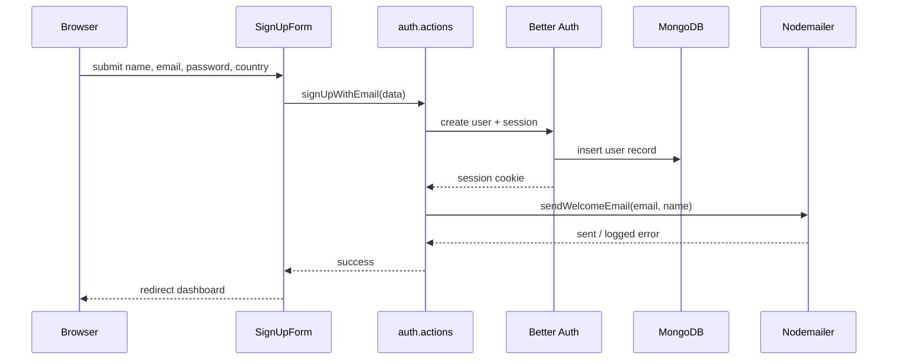

| Step | Data in | Data out | Persistence |
|------|---------|----------|-------------|
| 1 | Form: `fullName`, `email`, `password`, `country`, optional profile fields | — | — |
| 2 | Credentials | User document via Better Auth | `users` collection (adapter) |
| 3 | `email`, `name` | HTML email | None (SMTP only) |
| 4 | Session token | `Set-Cookie` | Session store |

---

## DF-02 — User Sign-In

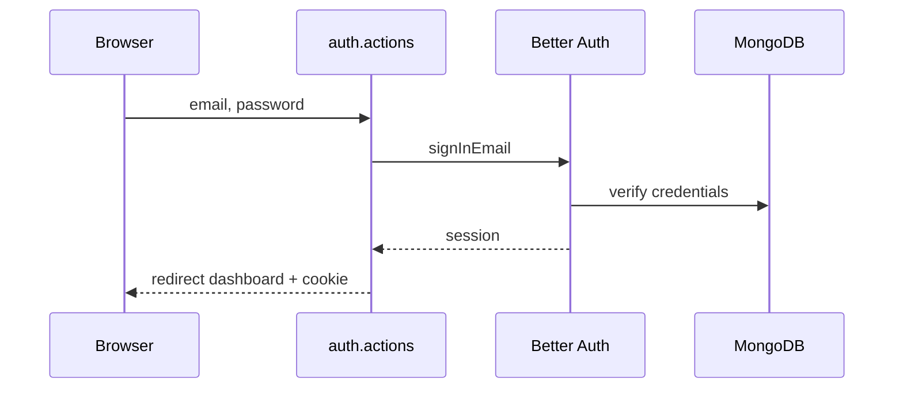

Sign-out: `auth.actions` → Better Auth `signOut` → clear cookie → redirect public route.

---

## DF-03 — Dashboard Load

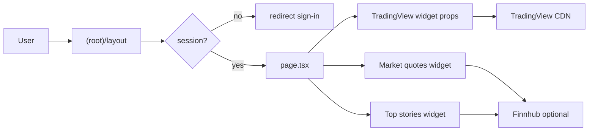

| Data | Source | Cached |
|------|--------|--------|
| Session user | Better Auth | Per request |
| Widget config | Static / constants | Yes |
| Index quotes | Finnhub or embed | Short TTL if API-backed |

Dashboard is **read-heavy**; widget failures do not block shell render (FR-D04).

---

## DF-04 — Symbol Search

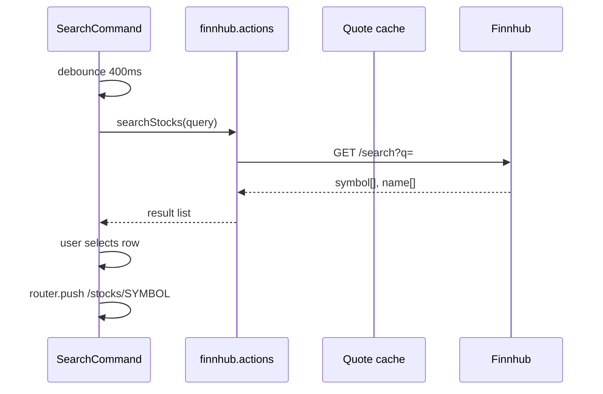

| Field | Direction |
|-------|-----------|
| `query` | Client → server action |
| `result[].symbol`, `result[].description` | Finnhub → UI |

No persistence on search alone.

---

## DF-05 — Stock Detail Load

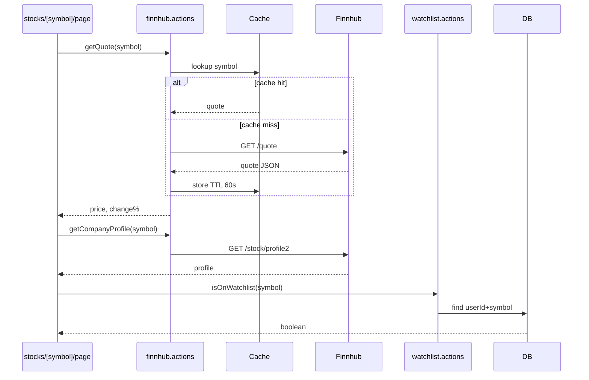

| Output to UI | Source |
|--------------|--------|
| `currentPrice`, `changePercent` | Finnhub quote |
| Company name, market cap, etc. | Finnhub profile |
| Chart | TradingView client widget |
| Watchlist button state | MongoDB watchlist |

---

## DF-06 — Watchlist Add / Remove

### Add

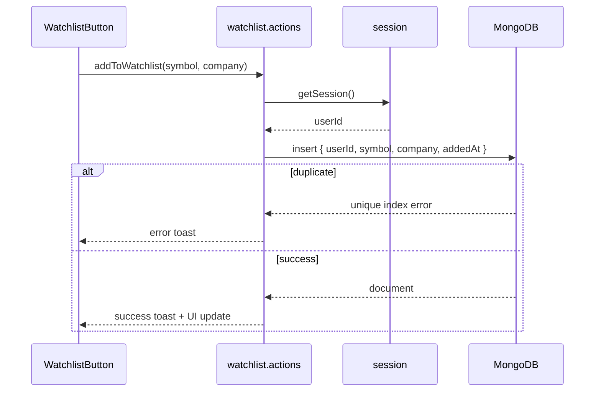

### Remove

`removeFromWatchlist(symbol)` → `deleteOne({ userId, symbol })` → UI toggle state.

**Data written:** one watchlist document per add. **No Finnhub call** on mutation (quotes enriched on read).

---

## DF-07 — Watchlist Page Load

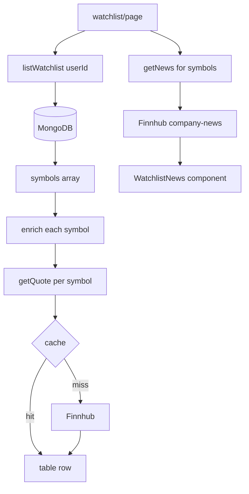

| Column | Data path |
|--------|-----------|
| Symbol, company | MongoDB |
| Price, change %, cap, P/E | Finnhub quote + profile (batched/deduped) |
| News headlines | Finnhub news API aggregated |

**Optimization:** Deduplicate symbol set before quote fetch; respect `QUOTE_CACHE_TTL_SECONDS` (NFR-R05).

---

## DF-08 — Alert Create / Delete

### Create

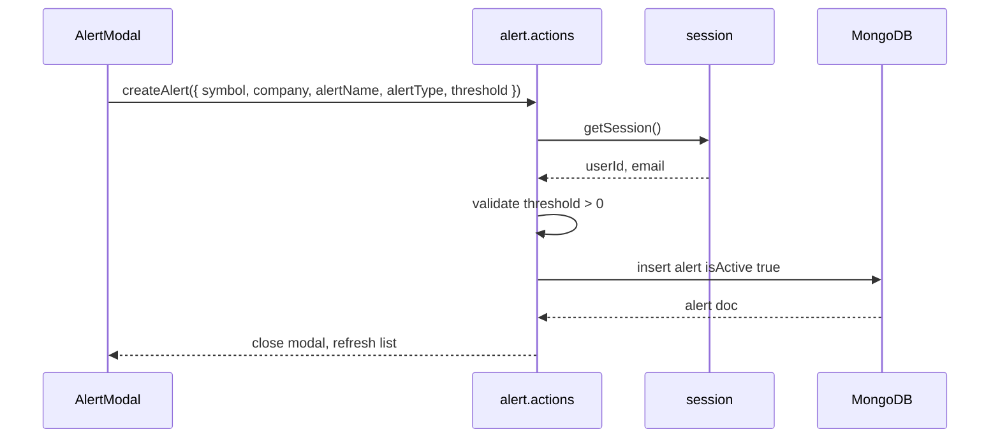

### Delete

`deleteAlert(alertId)` → verify `userId` ownership → `deleteOne` or soft-delete per implementation.

**Stored fields:** see [functional requirements](../requirements/functional-requirements.md) alert entity.

---

## DF-09 — Alert Price Check (Batch Job)

Core background flow — runs on Inngest schedule.

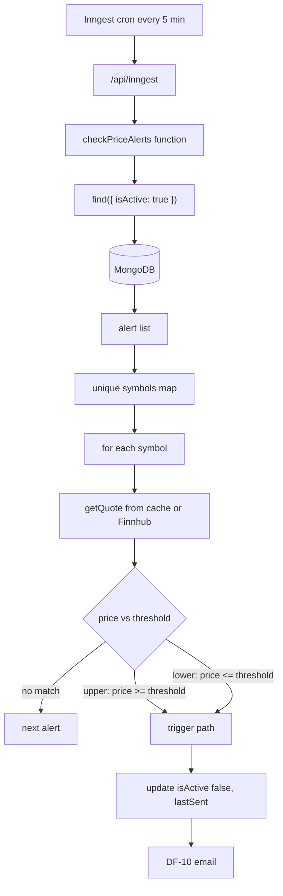

| Rule | Evaluation |
|------|------------|
| `upper` | `currentPrice >= threshold` |
| `lower` | `currentPrice <= threshold` |
| Quote missing | Skip alert this cycle; log (FR-J06) |
| Already inactive | Skip |

**Idempotency:** After trigger, `isActive: false` prevents re-fire (NFR-D01).

---

## DF-10 — Alert Email Delivery

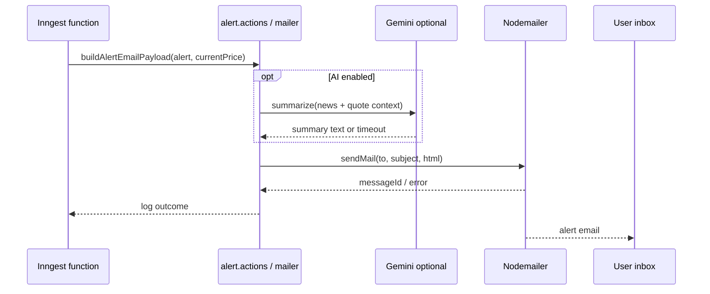

| Email field | Source |
|-------------|--------|
| `to` | `alert.userEmail` |
| Subject | Template: symbol + condition |
| Body | symbol, company, alertName, threshold, trigger price, optional AI blurb |
| Template | `lib/nodemailer/templates.ts` |

Failure: log error; Inngest may retry; alert state already `triggered` (FR-E04).

---

## DF-11 — Watchlist News

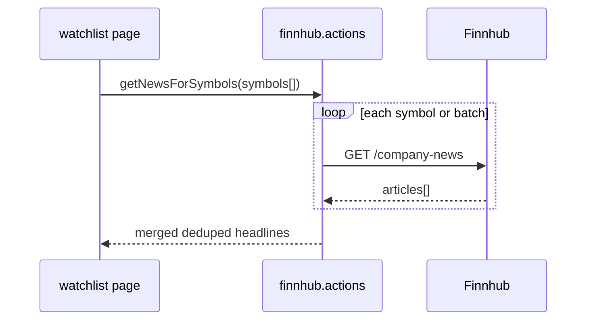

Read-only; failures show empty news panel with message (FR-W10).

---

## DF-12 — AI Summary (Optional)

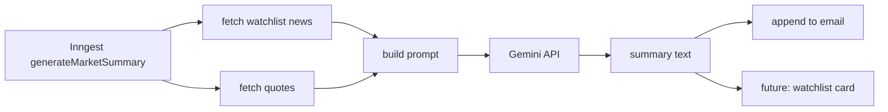

Constraints: 30s timeout (NFR-R08); no buy/sell language in prompt (FR-I02).

---

## Read vs Write Summary

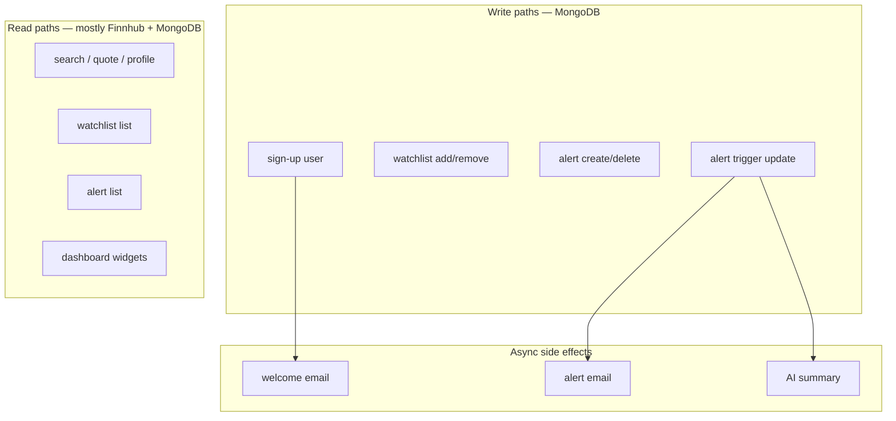

| Operation | Primary store | External read | External write |
|-----------|---------------|---------------|----------------|
| Auth | MongoDB (auth) | — | SMTP welcome |
| Watchlist CRUD | MongoDB | Finnhub on page load | — |
| Alert CRUD | MongoDB | — | — |
| Alert job | MongoDB | Finnhub quotes | SMTP alert |
| Search/detail | — | Finnhub | — |

---

## Caching Data Flow

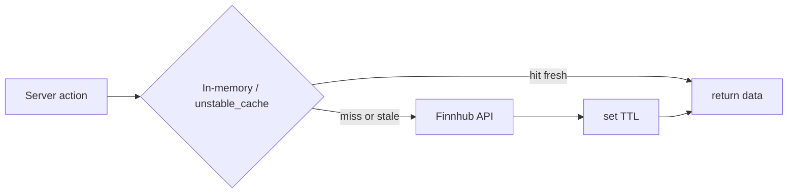

| Data type | Suggested TTL | Invalidation |
|-----------|---------------|--------------|
| Quote | 30–60s | TTL expiry |
| Company profile | 5–15 min | TTL expiry |
| Search results | None or 10s | Per-query short cache |
| News | 5 min | TTL expiry |

On HTTP 429 from Finnhub: return cached stale if available else error to UI (NFR-R04).

---

## End-to-End Anchor Flow (Data Perspective)

Single diagram tying discovery anchor scenario to data movement:

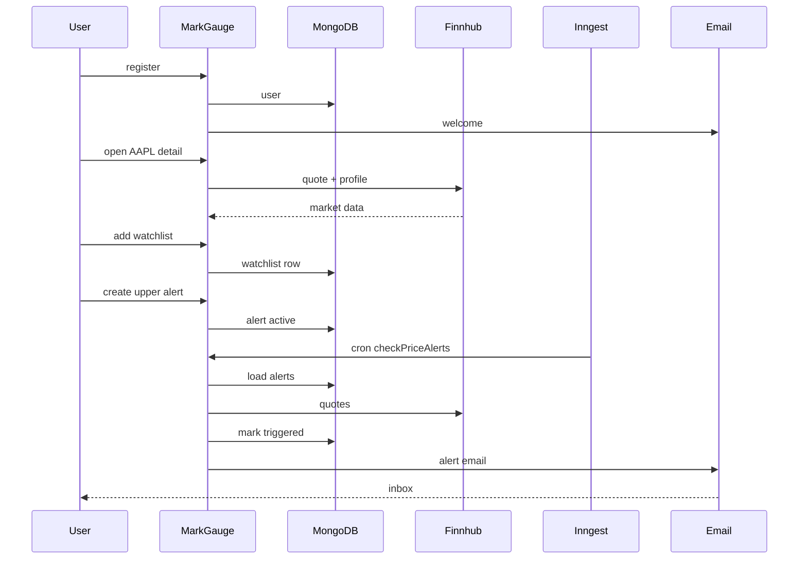

---

## Related Documents

- [System architecture](system-architecture.md)
- [Background jobs](background-jobs.md) *(upcoming)*
- [User flows](../requirements/user-flows.md)
- [Functional requirements](../requirements/functional-requirements.md)
- [Non-functional requirements](../requirements/non-functional-requirements.md)
