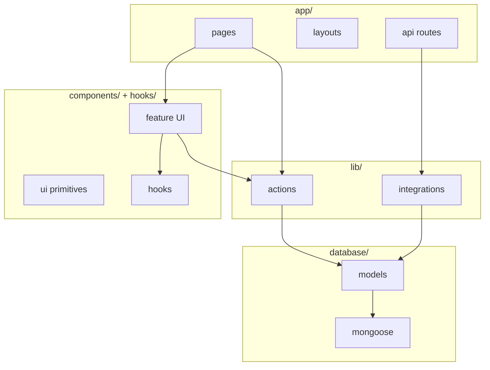

# Folder Structure

Planned repository layout for **MarkGauge** v1. Mirrors [system architecture](system-architecture.md) layers and supports [functional requirements](../requirements/functional-requirements.md) without premature files for non-goals.

---

## Top-Level Tree

```
markgauge/                          # project root (repo name TBD at scaffold)
├── app/                            # Next.js App Router — pages, layouts, API routes
├── components/                     # React UI — feature + shadcn/ui primitives
├── database/                       # Mongoose connection and models
├── hooks/                          # Client-side React hooks
├── lib/                            # Server utilities, actions, integrations
├── public/                         # Static assets
├── types/                          # Shared TypeScript declarations
├── docs/                           # Product & architecture documentation (this repo)
├── .env.example                    # Required environment variables template
├── components.json                 # shadcn/ui configuration
├── eslint.config.mjs               # ESLint flat config
├── next.config.ts                  # Next.js configuration
├── package.json
├── postcss.config.mjs
├── tsconfig.json                   # Path alias @/* → project root
└── README.md                       # Install, run, deploy (later milestone)
```

Optional post-v1 (not scaffolded in v1):

```
markgauge-worker/                   # Future WebSocket price worker — out of v1 scope
```

---

## `app/` — Routes & Layouts

```
app/
├── layout.tsx                      # Root: fonts, globals.css, Toaster provider
├── globals.css                     # Tailwind + theme tokens (dark, accent)
├── (auth)/
│   ├── layout.tsx                  # Minimal centered auth shell
│   ├── sign-in/
│   │   └── page.tsx
│   └── sign-up/
│       └── page.tsx
├── (root)/
│   ├── layout.tsx                  # Header + Footer; session check
│   ├── page.tsx                    # Dashboard — market widgets
│   ├── watchlist/
│   │   └── page.tsx                # Watchlist table + news
│   └── stocks/
│       └── [symbol]/
│           └── page.tsx            # Quote, chart, watchlist, alerts
└── api/
    ├── inngest/
    │   └── route.ts                # Inngest serve handler
    ├── alerts/
    │   └── route.ts                # Alert listing (dev/debug; secured in prod)
    └── trigger-alert/
        └── route.ts                # Enqueue alert/price.triggered event
```

### Route groups

| Group | URL pattern | Auth |
|-------|-------------|------|
| `(auth)` | `/sign-in`, `/sign-up` | Public |
| `(root)` | `/`, `/watchlist`, `/stocks/:symbol` | Session required |
| `api` | `/api/*` | Route-specific secrets |

Parentheses in folder names do not appear in URLs — Next.js route groups only.

---

## `components/` — UI

```
components/
├── ui/                             # shadcn/ui primitives (generated)
│   ├── button.tsx
│   ├── input.tsx
│   ├── label.tsx
│   ├── select.tsx
│   ├── dialog.tsx
│   ├── dropdown-menu.tsx
│   ├── command.tsx
│   ├── popover.tsx
│   ├── table.tsx
│   ├── avatar.tsx
│   └── sonner.tsx
├── forms/
│   ├── SignInForm.tsx
│   └── SignUpForm.tsx
├── Header.tsx
├── FooterLink.tsx
├── NavItems.tsx
├── UserDropdown.tsx
├── SearchCommand.tsx
├── InputField.tsx
├── SelectField.tsx
├── CountrySelectField.tsx
├── TradingViewWidget.tsx
├── WatchlistButton.tsx
├── WatchlistTable.tsx
├── WatchlistNews.tsx
├── AlertModal.tsx
└── AlertList.tsx
```

### Organization rules

| Rule | Detail |
|------|--------|
| `components/ui/` | Only shadcn-generated primitives; no business logic |
| Feature components | PascalCase at `components/` root or shallow subfolders |
| `'use client'` | Only on interactive components (forms, modals, search, charts) |
| Server Components | Pages and static layout sections default to server |

---

## `lib/` — Server Logic & Integrations

```
lib/
├── actions/
│   ├── auth.actions.ts             # signUp, signIn, signOut + inngest emit
│   ├── user.actions.ts             # User queries for news job
│   ├── watchlist.actions.ts        # add, remove, list, symbols by email
│   ├── alert.actions.ts            # create, delete, list, getUserAlerts
│   └── finnhub.actions.ts          # search, quote, profile, news
├── better-auth/
│   └── auth.ts                     # Better Auth config + exported auth
├── inngest/
│   ├── client.ts                   # Inngest instance (id: markgauge)
│   ├── functions.ts                # Cron + event functions
│   └── prompts.ts                  # Gemini prompt templates
├── nodemailer/
│   ├── index.ts                    # sendWelcomeEmail, sendPriceAlertEmail, etc.
│   └── templates.ts                # HTML email builders
├── constants.ts                    # Enums, widget IDs, copy constants
└── utils.ts                        # cn(), formatDate, shared helpers
```

### `lib/actions/` conventions

- Every file starts with `'use server'`.
- Resolve session via `auth.api.getSession({ headers: await headers() })`.
- Redirect to `/sign-in` when unauthenticated.
- Call `revalidatePath()` after mutations affecting watchlist or alerts UI.

### Import direction

```
app/ → lib/actions, lib/better-auth
lib/actions → database/models, lib/nodemailer, lib/inngest/client
lib/inngest/functions → lib/actions, database, nodemailer
components → lib/actions (as async imports in forms)
```

No imports from `app/` into `lib/`.

---

## `database/` — Persistence

```
database/
├── mongoose.ts                     # connectToDatabase() singleton
└── models/
    ├── watchlist.model.ts          # WatchlistItem schema
    └── alert.model.ts              # Alert schema
```

| File | Exports |
|------|---------|
| `mongoose.ts` | `connectToDatabase()` — cached global for serverless |
| `watchlist.model.ts` | default model + `WatchlistItem` interface |
| `alert.model.ts` | default model + `Alert` interface |

Better Auth may add its own collections via adapter — no duplicate user model file unless required by adapter docs.

---

## `hooks/` — Client Hooks

```
hooks/
├── useDebounce.ts                  # Search input debounce
└── useTradingViewWidget.ts         # Script inject + cleanup for chart embed
```

Client-only; no database or secret access.

---

## `types/` — TypeScript

```
types/
└── global.d.ts                     # SignUpFormData, AlertData, Finnhub types, etc.
```

Ambient types and third-party augmentations. Prefer colocated types in models when document-specific.

---

## `public/` — Static Assets

```
public/
└── assets/
    └── icons/
        ├── logo.svg
        └── star.svg
```

Images referenced as `/assets/icons/logo.svg`. README hero assets added in documentation milestone if needed.

---

## `docs/` — Documentation (eqLab)

```
docs/
├── discovery/                      # Idea & vision
├── requirements/                   # Research & specs
└── architecture/                   # This milestone
```

Application code and `docs/` coexist in the eqLab documentation repo; a future scaffold may live in same repo or separate app repo per your workflow.

---

## Path Aliases

**tsconfig.json:**

```json
{
  "compilerOptions": {
    "paths": {
      "@/*": ["./*"]
    }
  }
}
```

| Import | Resolves to |
|--------|-------------|
| `@/components/Header` | `components/Header.tsx` |
| `@/lib/actions/auth.actions` | `lib/actions/auth.actions.ts` |
| `@/database/models/alert.model` | `database/models/alert.model.ts` |

---

## File Naming Conventions

| Kind | Convention | Example |
|------|------------|---------|
| React component | PascalCase | `WatchlistTable.tsx` |
| Server action module | camelCase + `.actions.ts` | `watchlist.actions.ts` |
| Route handler | `route.ts` in folder | `app/api/inngest/route.ts` |
| Page | `page.tsx` | `app/(root)/page.tsx` |
| Layout | `layout.tsx` | `app/(root)/layout.tsx` |
| Mongoose model | `*.model.ts` | `alert.model.ts` |
| Hook | `use*.ts` | `useDebounce.ts` |
| Constants | SCREAMING_SNAKE in `constants.ts` | `INVESTMENT_GOALS` |

---

## Layer → Folder Map



---

## Scaffold Order (Implementation Milestone)

Recommended sequence when initializing the codebase:

| Step | Folders / files |
|------|-----------------|
| 1 | Root config: `package.json`, `tsconfig`, `next.config`, Tailwind, ESLint |
| 2 | `app/layout.tsx`, `globals.css`, `.env.example` |
| 3 | `database/mongoose.ts`, models |
| 4 | `lib/better-auth/auth.ts`, auth pages |
| 5 | `lib/actions/finnhub.actions.ts`, stock detail route |
| 6 | Watchlist components + actions |
| 7 | Alert components + actions |
| 8 | `lib/inngest/*`, API routes |
| 9 | `lib/nodemailer/*`, email templates |
| 10 | Dashboard widgets, polish |

---

## What Not to Create in v1

| Path | Reason |
|------|--------|
| `app/api/public/*` | No public API product |
| `components/social/` | Non-goal |
| `lib/broker/` | No trading execution |
| `markgauge-worker/` | Cron sufficient for v1 |
| `tests/` until QA milestone | Deferred per roadmap |
| `prisma/` | Mongoose chosen |

---

## Related Documents

- [System architecture](system-architecture.md)
- [Background jobs](background-jobs.md)
- [Tech stack](tech-stack.md)
- [Architecture index](README.md) *(upcoming)*
- [External services](../requirements/external-services.md)
