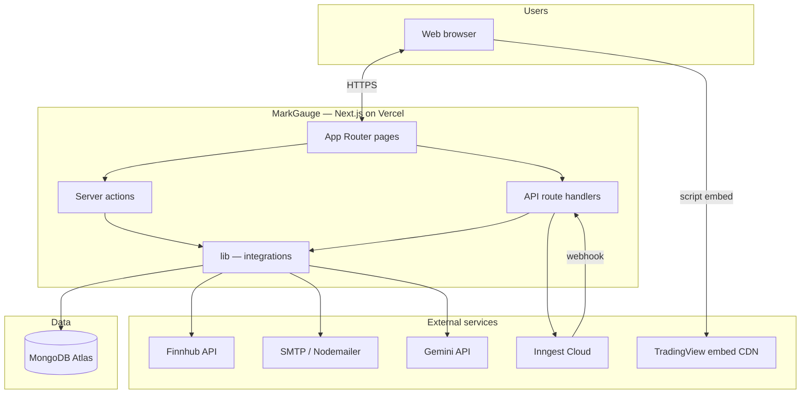
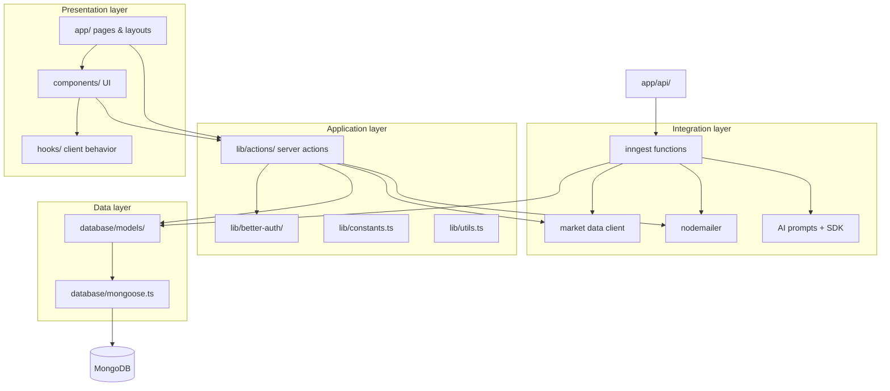
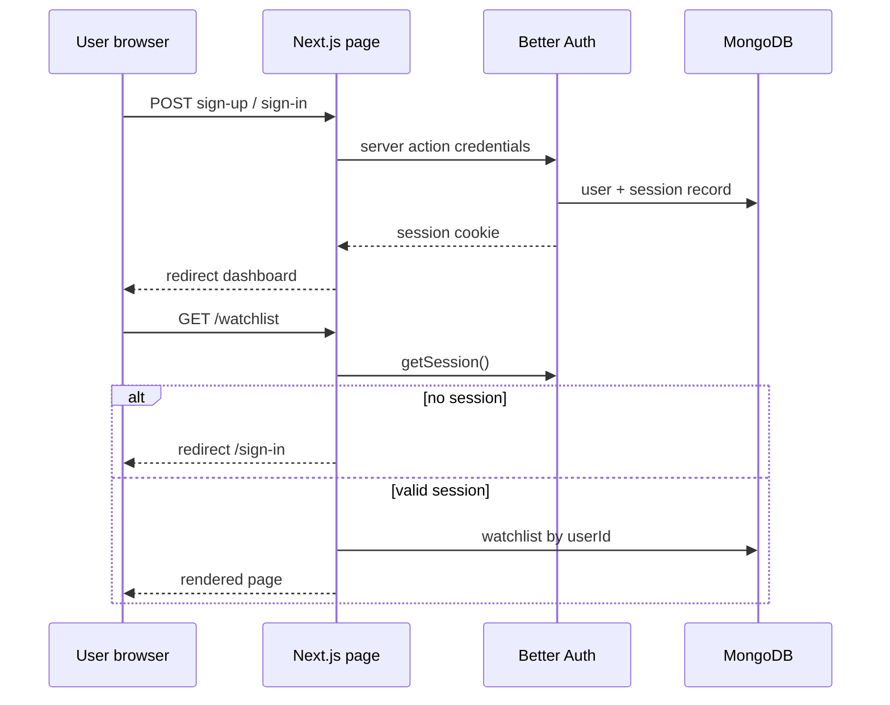
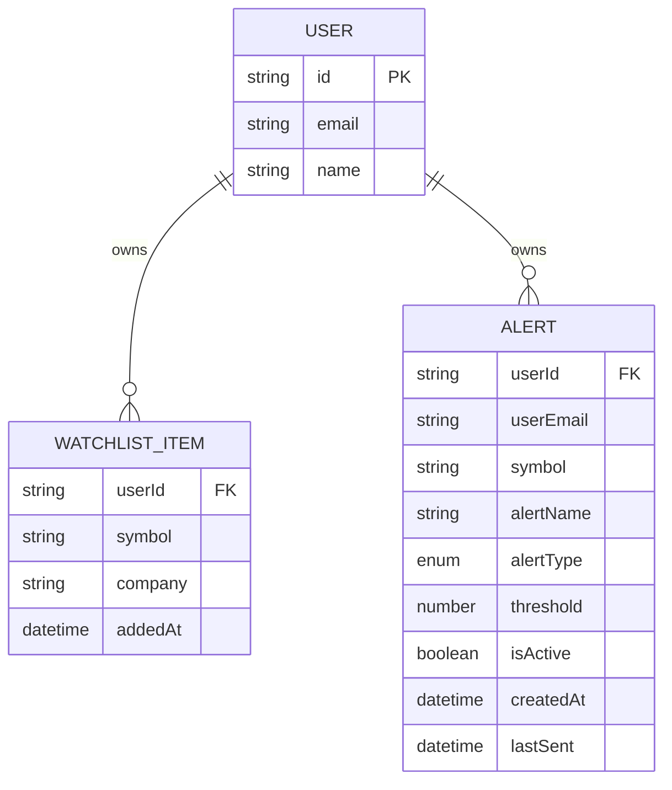
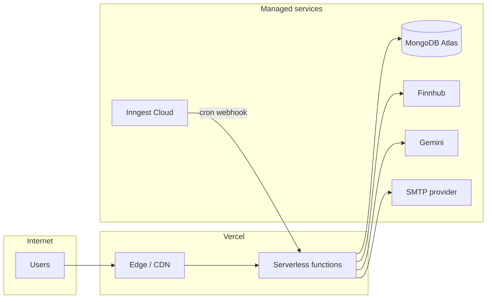
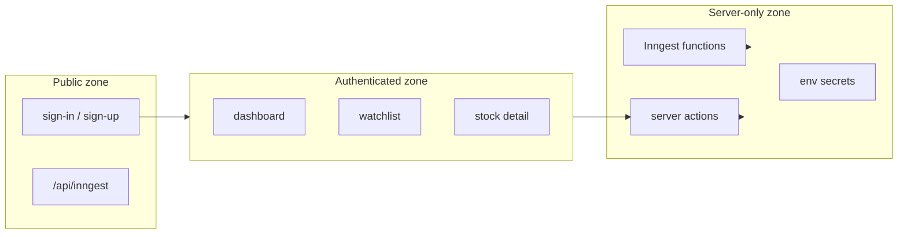

# System Architecture

High-level structure of **MarkGauge** — how browser, Next.js application, data stores, and external services connect. Complements the [tech stack decision record](tech-stack.md).

---

## Architectural Style

MarkGauge is a **server-centric full-stack web application**:

- **Next.js 15 App Router** serves UI (React Server Components + client islands) and server logic (server actions, route handlers).
- **MongoDB** holds user-scoped domain data (watchlists, alerts) and auth-linked records.
- **External APIs** provide market data, AI, and email; keys stay on the server.
- **Inngest** runs scheduled and durable background work outside the HTTP request path.

There is no separate BFF or microservice tier in v1. One deployable Next.js app plus managed external services.

---

## System Context

---

## Layered Architecture

Dependencies flow **inward**: UI → application logic → integrations → data.

| Layer | Location | Responsibility |
|-------|----------|----------------|
| **Presentation** | `app/`, `components/`, `hooks/` | Render UI, client interactivity, forms, widgets |
| **Application** | `lib/actions/`, `lib/better-auth/` | Auth checks, orchestration, validation, FR business rules |
| **Integration** | `lib/` modules, `lib/inngest/` | Third-party API calls, email, jobs |
| **Data** | `database/` | Mongoose schemas, connection, indexes |
| **API edge** | `app/api/` | Webhooks and job triggers only where HTTP required |

---

## Runtime Topology

### Request path (interactive)

1. Browser requests a page (e.g. `/watchlist`).
2. Next.js runs **layout** server components — session resolved via Better Auth.
3. Unauthenticated users redirected to `/sign-in` (FR-A08).
4. Page server component calls **server actions** or direct lib helpers to load data.
5. HTML streamed to client; client components hydrate (search, charts, modals).
6. Mutations invoke **server actions** (add watchlist, create alert) — no public REST CRUD for v1.

### Background path (alerts)

1. **Inngest Cloud** invokes cron on schedule (e.g. every 5 minutes).
2. Request hits `/api/inngest` with signed payload (NFR-S07).
3. Inngest function loads active alerts from MongoDB.
4. Quotes fetched from Finnhub (cached, deduped per symbol).
5. On trigger: update alert document, send email via Nodemailer.
6. Optional: Gemini summary appended to email body.

---

## Component Map

| Component | Path (planned) | Role |
|-----------|----------------|------|
| Root layout | `app/layout.tsx` | Fonts, global styles, providers |
| Auth layout | `app/(auth)/layout.tsx` | Minimal shell for sign-in/up |
| Main layout | `app/(root)/layout.tsx` | Header, footer, session-aware nav |
| Dashboard | `app/(root)/page.tsx` | Market widgets |
| Watchlist | `app/(root)/watchlist/page.tsx` | Table + news |
| Stock detail | `app/(root)/stocks/[symbol]/page.tsx` | Quote, chart, actions |
| Sign up / in | `app/(auth)/sign-up`, `sign-in` | Auth forms |
| Inngest serve | `app/api/inngest/route.ts` | Register functions |
| Alerts API | `app/api/alerts/route.ts` | Worker/support endpoints |
| Trigger API | `app/api/trigger-alert/route.ts` | Manual/cron smoke trigger |
| Auth config | `lib/better-auth/auth.ts` | Better Auth instance |
| DB connection | `database/mongoose.ts` | Mongoose singleton |
| Watchlist model | `database/models/watchlist.model.ts` | Schema + indexes |
| Alert model | `database/models/alert.model.ts` | Schema + indexes |
| Auth actions | `lib/actions/auth.actions.ts` | Sign-up flow + welcome email |
| Watchlist actions | `lib/actions/watchlist.actions.ts` | CRUD |
| Alert actions | `lib/actions/alert.actions.ts` | CRUD + trigger helpers |
| Market actions | `lib/actions/finnhub.actions.ts` | Search, quote, profile, news |
| Inngest client | `lib/inngest/client.ts` | Client instance |
| Inngest functions | `lib/inngest/functions.ts` | Cron handlers |
| Email | `lib/nodemailer/` | Transport + templates |

---

## Authentication Architecture

- **Session model:** HTTP-only cookies managed by Better Auth (NFR-S03).
- **Authorization:** Server actions read `userId` from session; all queries include `userId` filter (FR-X01, FR-X02).
- **No custom JWT** in application code for v1.

---

## Data Architecture (logical)

- **User** entity owned by Better Auth adapter schema.
- **Watchlist** and **Alert** are application collections with `userId` foreign key (string).
- No cross-user joins or shared lists in v1.

---

## External Integration Boundaries

| Boundary | Direction | Protocol | Secret exposure |
|----------|-----------|----------|-----------------|
| Browser ↔ Next.js | Inbound | HTTPS | None |
| Next.js ↔ MongoDB | Outbound | MongoDB wire | `MONGODB_URI` server only |
| Next.js ↔ Finnhub | Outbound | REST | `FINNHUB_API_KEY` server only |
| Next.js ↔ SMTP | Outbound | SMTP/TLS | `NODEMAILER_*` server only |
| Next.js ↔ Gemini | Outbound | HTTPS API | `GEMINI_API_KEY` server only |
| Inngest ↔ Next.js | Inbound webhook | HTTPS + signature | `INNGEST_SIGNING_KEY` |
| Browser ↔ TradingView | Script embed | CDN | Public embed config only |

Market data never flows browser → Finnhub directly for quote/profile paths (server actions only).

---

## Deployment Architecture

| Environment | App URL | Database | Notes |
|-------------|---------|----------|-------|
| Local | `localhost:3000` | Local or Atlas dev cluster | Inngest dev server |
| Production | `NEXT_PUBLIC_BASE_URL` | Atlas production | Env vars in Vercel dashboard |

---

## Scalability & Serverless Constraints

| Concern | v1 approach |
|---------|-------------|
| Horizontal scale | Stateless Next.js instances; session in cookie + DB |
| DB connections | Mongoose connection caching for serverless warm starts |
| Long work | Alert batches and AI in Inngest steps, not page requests |
| Cold starts | Acceptable for retail monitoring; cache hot quotes |
| File storage | None in v1 — no user uploads |

---

## Security Zones

- **Public:** Auth pages; API routes validate signatures or secrets.
- **Authenticated:** All `(root)` pages require session.
- **Server-only:** API keys, SMTP creds, raw Finnhub responses before sanitization.

---

## Failure Isolation

| Failure | User-visible behavior | System behavior |
|---------|----------------------|-----------------|
| Finnhub down | Error on quote/detail; dashboard fallback | Log; job skips symbol |
| MongoDB down | 500 / error page | Alert job fails; retry |
| SMTP failure | User still sees alert triggered in app | Log; Inngest retry email step |
| Gemini failure | Email without AI paragraph | Non-blocking degrade |
| Inngest delay | Late email | Next cron catches cross if still valid |

Aligns with NFR-U02 unacceptable vs. acceptable degradation modes.

---

## Related Documents

- [Tech stack decisions](tech-stack.md)
- [Data flows](data-flows.md) *(upcoming)*
- [Background jobs](background-jobs.md) *(upcoming)*
- [Folder structure](folder-structure.md) *(upcoming)*
- [Functional requirements](../requirements/functional-requirements.md)
- [External services](../requirements/external-services.md)
