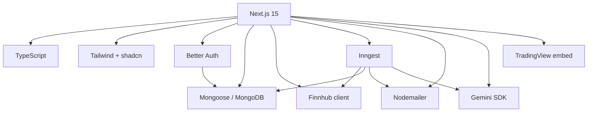

# Tech Stack Decision Record

Technology choices for **MarkGauge** v1. Each decision traces to [functional requirements](../requirements/functional-requirements.md), [non-functional requirements](../requirements/non-functional-requirements.md), and [external services](../requirements/external-services.md).

**Status:** Accepted for implementation  
**Last updated:** 2026-06-30

---

## Summary

| Layer | Choice | Version target |
|-------|--------|----------------|
| Framework | Next.js (App Router) | 15.x |
| Language | TypeScript | 5.x |
| Styling | Tailwind CSS | 4.x |
| UI primitives | Radix UI via shadcn/ui | Latest compatible |
| Icons | Lucide React | Latest |
| Database | MongoDB + Mongoose | 7.x / 8.x |
| Authentication | Better Auth | Latest |
| Market data | Finnhub REST API | v1 |
| Background jobs | Inngest | Latest |
| Email | Nodemailer (SMTP) | Latest |
| AI | Google Gemini API | Latest SDK |
| Charts (embed) | TradingView widget | Embed script |
| Hosting | Vercel (or equivalent) | Serverless |
| Linting | ESLint | Flat config |

---

## D1 — Next.js 15 with App Router

### Decision

Use **Next.js 15** with the **App Router** as the sole web framework.

### Rationale

- **Server Components and server actions** map directly to MarkGauge patterns: authenticated pages, form mutations (watchlist, alerts), and server-only API keys for Finnhub (FR-M*, NFR-S06).
- **Route groups** `(auth)` and `(root)` match the layout split in user flows (FR-N01, FR-N02).
- **API routes** host Inngest webhook and alert trigger endpoints (FR-J05).
- **Vercel deployment** aligns with NFR-U01 and NFR-E04 without custom server ops.
- Team familiarity and ecosystem (shadcn/ui, Better Auth) reduce integration risk.

### Alternatives considered

| Option | Rejected because |
|--------|------------------|
| Remix | Capable; less alignment with reference component libraries and hosting defaults |
| Vite + Express SPA | Loses RSC/server actions; more custom auth and API glue |
| Create React App | Deprecated path; no first-class server layer |

### Consequences

- Server actions are primary mutation path; REST used where webhooks require it.
- `use client` boundary discipline required for interactive widgets (search, charts, forms).

---

## D2 — TypeScript (strict)

### Decision

**TypeScript** in strict mode across app, components, lib, and database layers.

### Rationale

- Shared types for Finnhub responses, alert/watchlist models, and form data (NFR-M01).
- Compile-time checks on server action payloads reduce runtime validation gaps.
- Industry standard for Next.js greenfield projects.

### Consequences

- `types/global.d.ts` for ambient types and third-party augmentations.
- Path alias `@/*` for imports (configured in `tsconfig.json` during project setup).

---

## D3 — Tailwind CSS + shadcn/ui (Radix UI)

### Decision

**Tailwind CSS** for styling; **shadcn/ui** components built on **Radix UI** primitives.

### Rationale

- Dark theme and brand accent (FR-N06) via Tailwind tokens and `globals.css`.
- Accessible dialogs, dropdowns, tables, and forms out of the box (NFR-X03).
- Copy-in components (`components/ui/`) — no opaque UI black box.
- Matches watchlist table, alert modal, search command, and user dropdown requirements.

### Component inventory (v1)

| UI need | shadcn / Radix building block |
|---------|------------------------------|
| Sign-up / sign-in forms | `button`, `input`, `label`, `select` |
| Alert modal | `dialog` |
| User menu | `dropdown-menu`, `avatar` |
| Watchlist table | `table` |
| Search | `command`, `popover` |
| Feedback | `sonner` (toast) |

### Alternatives considered

| Option | Rejected because |
|--------|------------------|
| Material UI | Heavier bundle; harder to match custom dark finance aesthetic |
| Chakra UI | Viable; shadcn offers more control with Tailwind co-location |

---

## D4 — MongoDB with Mongoose

### Decision

**MongoDB** as primary datastore; **Mongoose** ODM for schemas and indexes.

### Rationale

- Document model fits watchlist and alert entities with minimal joins (FR-W04, FR-L07).
- Compound unique index on `(userId, symbol)` is natural in MongoDB (NFR-D03).
- Better Auth adapter supports MongoDB for user/session persistence.
- Managed Atlas satisfies backup and availability NFRs (NFR-D08, NFR-U03).

### Alternatives considered

| Option | Rejected because |
|--------|------------------|
| PostgreSQL + Prisma | Valid; more migration ceremony for v1 document shapes |
| Supabase Postgres | Adds RLS learning curve; auth overlap with Better Auth |

### Consequences

- Connection helper in `database/mongoose.ts` with singleton pattern for serverless.
- Models in `database/models/`.

---

## D5 — Better Auth

### Decision

**Better Auth** for email/password authentication and session management.

### Rationale

- App Router–first API; cookie sessions without custom JWT plumbing (NFR-S01–S03).
- Sign-up fields support extended profile on registration (FR-A01, FR-A02).
- Server-side `auth.api.getSession()` pattern for protected layouts and actions.

### Alternatives considered

| Option | Rejected because |
|--------|------------------|
| Clerk | Hosted vendor; cost and data residency for simple email auth |
| Auth.js | Either works; Better Auth chosen for explicit Next 15 patterns in target stack |

### Consequences

- Config centralized in `lib/better-auth/auth.ts`.
- Auth pages under `app/(auth)/`.

---

## D6 — Finnhub (market data)

### Decision

**Finnhub** REST API for search, quotes, company profile, and news.

### Rationale

- Documented in external services; endpoints cover all FR-M* requirements.
- Server-side key keeps secrets off client (NFR-S06).
- Caching layer in `lib/actions` reduces rate-limit pressure (NFR-R02).

### Consequences

- All market calls through `lib/actions/finnhub.actions.ts` (or equivalent module name).
- No client-side Finnhub calls except where embed widgets require public keys.

---

## D7 — Inngest (background jobs)

### Decision

**Inngest** for scheduled alert evaluation and optional AI summary jobs.

### Rationale

- Cron without always-on server (NFR-C05, NFR-U04).
- Retries and dashboard for job failures (NFR-D06, NFR-O02).
- Native Next.js route at `/api/inngest` (FR-J05).

### Functions planned

| Function | Schedule | Purpose |
|----------|----------|---------|
| `checkPriceAlerts` | Every 5 minutes | FR-J01–J04 |
| `generateMarketSummary` | Optional cron | FR-J07, FR-I01 |

### Alternatives considered

| Option | Rejected because |
|--------|------------------|
| Vercel Cron only | Manual retry/idempotency logic |
| BullMQ + Redis | Extra infrastructure |

### Consequences

- Client and functions in `lib/inngest/`.
- Optional separate worker process documented if long-running tasks added later.

---

## D8 — Nodemailer (SMTP email)

### Decision

**Nodemailer** with SMTP transport for welcome and alert emails.

### Rationale

- FR-E01–E04; works with Gmail app passwords, SendGrid SMTP, Mailgun SMTP.
- HTML templates colocated in `lib/nodemailer/templates.ts`.

### Consequences

- No marketing ESP required for v1 transactional volume (NFR-R10).

---

## D9 — Google Gemini (AI summaries)

### Decision

**Gemini API** for bounded watchlist/alert summaries (should-have P1).

### Rationale

- FR-I01–I04; optional path must not block alert email (NFR-R08).
- Prompts in `lib/inngest/prompts.ts` with no-advice system instructions.

### Consequences

- AI calls only from server and Inngest functions — never browser-exposed key.

---

## D10 — TradingView chart embed

### Decision

**TradingView** embedded widget for stock detail charts (not a custom chart library).

### Rationale

- FR-S06 without building charting engine (non-goal: advanced charting).
- Lazy-loaded client component (NFR-P10).

### Consequences

- Hook `hooks/useTradingViewWidget.ts` manages script injection lifecycle.

---

## D11 — Hosting and runtime

### Decision

Deploy production app to **Vercel** (or equivalent serverless Next.js host).

### Rationale

- NFR-U01, NFR-E02, NFR-E04.
- Inngest cloud pairs with Vercel deploys.
- MongoDB Atlas external to compute region.

### Consequences

- Environment variables per deployment target.
- Serverless function timeout awareness for long AI calls (keep AI in Inngest steps).

---

## D12 — Tooling

| Tool | Purpose |
|------|---------|
| ESLint | NFR-M02 lint gate |
| PostCSS | Tailwind pipeline |
| `components.json` | shadcn/ui config |
| Git | Version control; no monorepo required for v1 |

Testing frameworks deferred to QA milestone; architecture leaves hooks testable via server actions.

---

## Dependency Graph (logical)

---

## What We Are Not Adding (v1)

Aligned with [non-goals](../discovery/non-goals.md):

- No Redis, Kafka, or message bus beyond Inngest
- No GraphQL layer
- No separate BFF service
- No mobile native stack
- No microservices split

---

## Related Documents

- [System architecture](system-architecture.md)
- [Data flows](data-flows.md)
- [Background jobs](background-jobs.md)
- [Folder structure](folder-structure.md)
- [Architecture index](README.md)
- [External services](../requirements/external-services.md)
