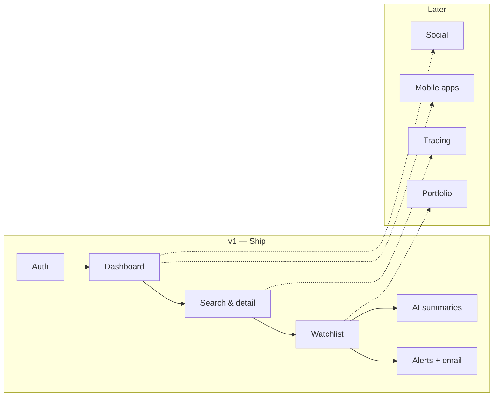

# Goals and Scope

This document sets what MarkGauge v1 must achieve and which capabilities sit inside the first release boundary. It translates vision and value propositions into concrete goals, an anchor user scenario, and a feature scope table. Explicit exclusions are summarized here and expanded in the non-goals document.

---

## Product Goals

### G1 — Consolidate monitoring

Give signed-in users one web workspace where live quotes, a personal watchlist, and symbol detail pages coexist without switching broker tabs or aggregator sites.

### G2 — Enable dependable alerts

Let users define price rules per symbol and receive email when conditions are met, backed by scheduled background checks rather than manual refresh.

### G3 — Reduce time-to-awareness

Shorten the path from registration to first useful outcome: list built, alert set, notification received.

### G4 — Earn trust through data honesty

Show real API-sourced quotes and explicit failure states; never display synthetic prices when upstream data is missing.

### G5 — Establish a foundation for growth

Ship on a modern full-stack architecture (authenticated web app, document database, external market data, job runner, email) so later features extend rather than replace core flows.

---

## Measurable Targets (v1)

| Goal | Metric | Target |
|------|--------|--------|
| Activation | User completes sign-up and adds ≥1 symbol to watchlist | Within first session |
| Alert adoption | User creates ≥1 active price alert | Within first week of use |
| Alert reliability | Triggered alert delivers email | Within agreed check interval after cross |
| Engagement | Signed-in user views dashboard or watchlist | Repeat visit within 7 days |
| Data quality | Quote fetch failures surface user-visible error | 100% of failure paths handled |
| Onboarding | New developer runs app locally from docs | Under 45 minutes with env template |

These are discovery-level targets; engineering milestones will attach implementation checkpoints in later documents.

---

## Anchor Scenario — First-Time Monitor

**Context:** Alex is an active trader persona who currently keeps twelve symbols in a spreadsheet and checks three websites each morning.

| Step | Actor | Action | Success signal |
|------|-------|--------|----------------|
| 1 | Alex | Registers and signs in | Session persists; welcome email received |
| 2 | Alex | Searches a symbol and opens detail | Live quote, chart, and company summary visible |
| 3 | Alex | Adds three symbols to watchlist | Symbols appear on watchlist page with live fields |
| 4 | Alex | Sets alert: cross above target on one symbol | Alert listed as active in account UI |
| 5 | System | Background job evaluates prices | Job runs on schedule without user action |
| 6 | System | Price crosses threshold | Alert marked triggered; email sent |
| 7 | Alex | Opens email and returns to app | Can confirm symbol state on detail and watchlist |

If this scenario completes without spreadsheets, manual refresh loops, or silent alert failures, v1 has proven its core value.

---

## v1 Scope — In

### Identity and access

- Email-based sign-up and sign-in
- Session-aware navigation; protected routes for dashboard, watchlist, and stock detail
- Sign-out and user menu
- Welcome email on registration

### Market data and search

- Symbol search with autocomplete
- Stock detail page: quote, change, chart widget, company profile
- Server-side integration with licensed market data API
- Caching and error handling for rate limits and upstream failures

### Dashboard

- Home page with market overview widgets (indices, heatmap-style view, top stories)
- Entry points to search, watchlist, and auth flows

### Watchlist

- Add and remove symbols (user-scoped)
- Watchlist page with table: symbol, company name, live price, change %, market cap, P/E where available
- News panel related to watchlist symbols

### Alerts

- Create alert: symbol, target price, condition (above / below)
- List and delete active alerts
- Background worker checks prices on schedule
- Email notification when alert triggers

### AI insights (bounded)

- Optional summaries for watchlist or alert context using retrieved news and quote data
- Clear non-advice framing in UI and email copy

### UI and experience

- Responsive web layout, desktop-first
- Dark theme with consistent brand accent
- Shared header, footer, and form components
- Toast or inline feedback for user actions

### Operations

- Environment template for all third-party keys
- Lint-clean codebase; deployable to managed hosting
- Local development documented for later milestones

---

## v1 Scope — Deferred (Future Releases)

Capabilities acknowledged in vision but **not** required for first release proof:

| Area | Future intent | Why deferred |
|------|---------------|--------------|
| Portfolio tracking | Holdings, cost basis, allocation views | Requires brokerage import or manual position entry; separate data model |
| Order execution | Buy/sell integration | Regulatory and broker API complexity; out of product category |
| Native mobile apps | iOS / Android clients | Web-first validates core; native adds store and push infrastructure |
| Social features | Feeds, sharing, leaderboards | Different engagement model; risk of noise vs. monitoring focus |
| Multi-user workspaces | Teams, shared watchlists | B2B pattern; v1 is individual account |
| Advanced charting | Custom indicators, drawing tools | TradingView embed covers baseline; pro tools are scope creep |
| SMS / push notifications | Channels beyond email | Email proves alert path; push adds device and consent plumbing |
| Crypto and forex | Non-equity asset classes | Different data vendors and UX expectations |
| Tax and reporting | Gain/loss exports | Depends on portfolio tracking |
| Public API for third parties | Developer platform | No external consumers until product core is stable |

---

## Scope Boundary Diagram

Solid arrows: v1 user path. Dotted lines: intentional future extensions, not v1 dependencies.

---

## Release Principles

When trade-offs appear during build:

1. **Alert reliability beats feature count** — a working email on price cross matters more than extra dashboard widgets.
2. **Watchlist integrity beats chart polish** — users must trust their list persists and updates.
3. **Honest errors beat silent failure** — show "quote unavailable" rather than stale or guessed numbers.
4. **Desktop web beats mobile parity** — layout works on tablet width; native apps are future.
5. **Individual account beats collaboration** — no team permissions or sharing in v1.

---

## Definition of Done (Discovery Level)

MarkGauge v1 is "done" for idea-to-build handoff when:

- [ ] Anchor scenario (register → watchlist → alert → email) is describable end-to-end
- [ ] In-scope features map to all four value pillars with must-have items covered
- [ ] Deferred items are listed with rationale, not vague "later maybe"
- [ ] Non-goals document aligns with deferred table and states explicit exclusions
- [ ] Stakeholder can read goals, scope, and non-goals and agree on v1 boundary without reading architecture docs

Engineering checklists and test plans belong in later milestones.

---

## Alignment with Personas

| Persona | v1 must satisfy |
|---------|-----------------|
| Active Trader | Live quotes, fast search, reliable alerts |
| Long-Term Holder | Persistent watchlist, email on large moves |
| Portfolio Enthusiast | Watchlist table with context fields, list-scoped news |
| Part-Time Monitor | Low-setup dashboard, email-centric awareness |

No persona requires portfolio tracking or social features for v1 validation.

---

## Related Documents

- [Problem statement](problem-statement.md)
- [Vision and product pitch](vision.md)
- [User personas](personas.md)
- [Value propositions](value-propositions.md)
- [Non-goals](non-goals.md) *(upcoming)*
