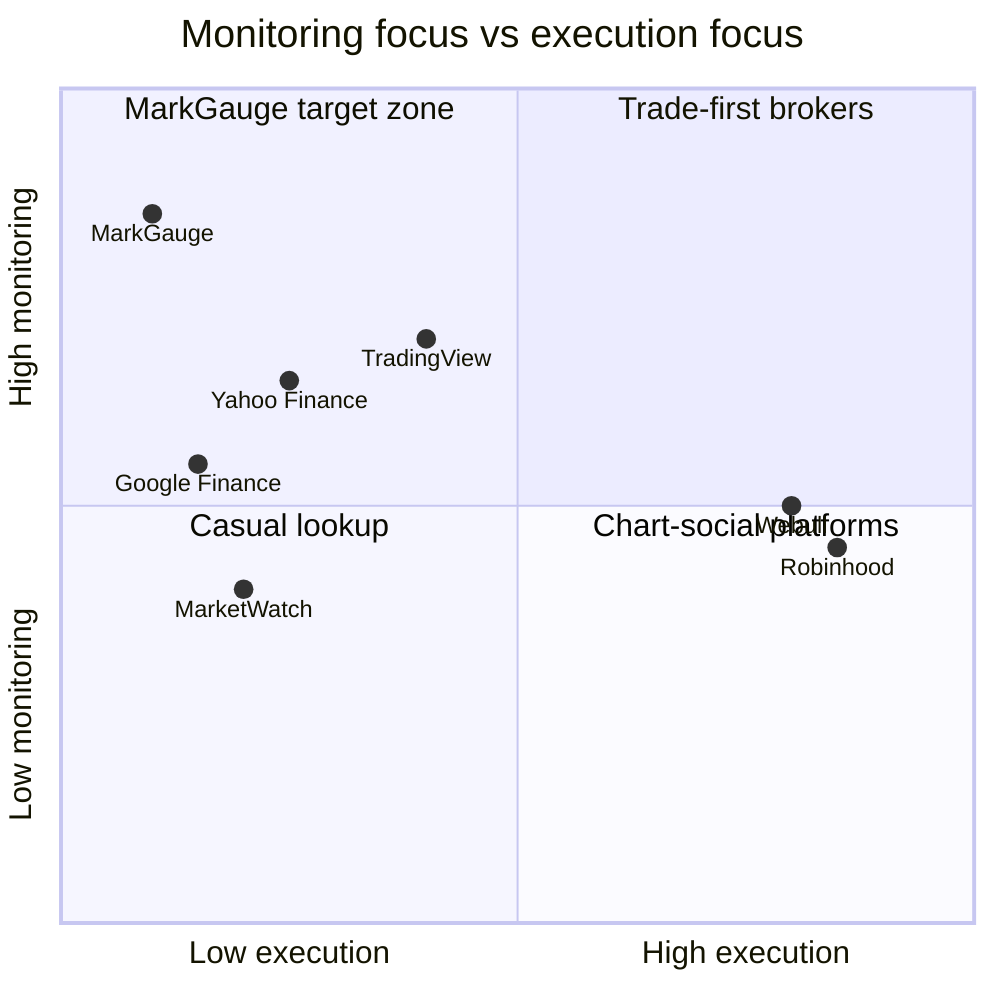

# Competitor Analysis

Comparative research for **MarkGauge** — a personal equity monitoring workspace — against products users already reach for when tracking stocks, building lists, and reacting to price moves. This analysis informs differentiation, v1 scope discipline, and requirements in subsequent documents.

**Method:** Desk review of public positioning, feature sets, and known user complaints (as of mid-2026). No formal user interviews in this pass.

---

## Evaluation Criteria

| Criterion | What we measure | MarkGauge relevance |
|-----------|-----------------|---------------------|
| **Monitoring focus** | Quotes, lists, alerts without mandatory trading | Core v1 job |
| **Watchlist quality** | Persistence, live fields, portability across sessions | Primary retention object |
| **Alert capability** | Price rules, channels, reliability | Key differentiator |
| **Chart / detail depth** | Symbol pages, embedded charts, company context | Table stakes for active traders |
| **Noise level** | Ads, social feeds, promotional content | Vision theme: clarity over noise |
| **Account friction** | Signup required for basic quotes vs. open browse | Trade-off: auth enables owned lists |
| **AI / insight** | Summaries, news tie-in, advice risk | Bounded v1 pillar |
| **Individual vs. social** | Personal workspace vs. community features | MarkGauge is individual-first |

---

## Competitor Overview

| Product | Primary category | Best for | Weak fit for MarkGauge user |
|---------|------------------|----------|----------------------------|
| Yahoo Finance | Free finance portal | Broad market news, free quotes, casual lists | Users wanting ad-free, alert-centric workspace |
| TradingView | Charting & community | Technical analysis, shared ideas, advanced charts | Users who only want lists + email alerts |
| Robinhood (web) | Retail brokerage | Order execution, account-native lists | Non-traders who refuse brokerage signup |
| Google Finance | Lightweight tracker | Quick lookups, simple list | Deep alerts, email lifecycle, AI summaries |
| MarketWatch | News + quotes | Headlines, market narrative | Personalized alert engine |
| Webull | Active-trader brokerage | Free L2 on mobile, trading tools | Monitoring-only users |
| Personal Capital / Empower | Wealth aggregation | Net worth, retirement accounts | Single-name watchlists and price crosses |

---

## Yahoo Finance

### Positioning

Mass-market free aggregator: indices, news, screener, portfolio tools, and watchlists backed by a large content operation.

### Strengths

- Familiar brand; strong SEO for ticker lookups
- Free real-time-ish quotes for many US symbols
- Watchlists sync with account; mobile apps available
- News, earnings calendar, and community-adjacent content
- Basic price alerts on mobile

### Weaknesses (relative to MarkGauge)

- Ad-heavy and content-forward UI increases cognitive load
- Alert experience varies by platform; email rules less central than browsing
- Feature breadth (crypto, portfolios, premium tiers) dilutes monitoring focus
- Users report list and alert limits feeling opaque across free vs. paid

### Takeaway for MarkGauge

Compete on **calm density**: one dark workspace where list + alert + email is the hero path, not news feed monetization. Do not try to out-news Yahoo; out-focus them.

---

## TradingView

### Positioning

Chart-first platform with social layer (ideas, scripts, public watchlists) and optional brokerage connections.

### Strengths

- Best-in-class interactive charts and indicators
- Powerful alerts (multiple conditions, webhook on paid tiers)
- Large symbol coverage and community-generated content
- Desktop and mobile clients

### Weaknesses (relative to MarkGauge)

- Learning curve and UI complexity for casual monitors
- Meaningful alert counts and advanced triggers often paywalled
- Social feed can dominate attention vs. personal list discipline
- Overkill for users who want email on three symbols, not Pine Script

### Takeaway for MarkGauge

Embed chart capability on symbol detail (widget approach) rather than rebuilding TradingView. Win users who **bounce off** complexity or subscription tiers for simple price-cross email.

---

## Robinhood (Web)

### Positioning

Commission-free brokerage; web and app centered on account, positions, and order entry.

### Strengths

- Seamless watchlist tied to tradable universe
- Push notifications for price movements (account holders)
- Clean consumer UX for younger retail cohort
- Instant familiarity for users who already trade there

### Weaknesses (relative to MarkGauge)

- Watchlist trapped inside brokerage relationship
- Monitoring features serve conversion to trade, not standalone awareness
- Users without Robinhood accounts gain little
- Alert semantics tied to app push, not a dedicated monitoring product

### Takeaway for MarkGauge

Serve users who **will not** open a brokerage account for monitoring alone, or who use a different broker but want a portable list and alert hub.

---

## Google Finance

### Positioning

Minimal Google ecosystem tracker: quotes, news cards, simple watchlist, integration with Search.

### Strengths

- Extremely low friction for quick price checks
- Clean, fast interface without brokerage pressure
- Watchlist follows Google account

### Weaknesses (relative to MarkGauge)

- Limited alert sophistication; not built as notification-first product
- Sparse symbol detail vs. dedicated finance portals
- Product investment historically intermittent
- No AI summary layer or background job narrative for alert reliability

### Takeaway for MarkGauge

Match **simplicity** on dashboard glance; exceed on **alert lifecycle** (create → schedule → trigger → email audit).

---

## MarketWatch

### Positioning

Dow Jones–backed financial news with market data and personalization features.

### Strengths

- High-quality journalism and market storytelling
- Tools for investors who read heavily
- Brand trust for news accuracy

### Weaknesses (relative to MarkGauge)

- News-first; watchlist and alerts secondary
- Paywall and subscription dynamics on premium content
- Less appealing to traders wanting fast symbol → alert loop

### Takeaway for MarkGauge

Pull **headlines per watchlist symbol** via data API; do not build a newsroom. Informational depth without editorial operation.

---

## Webull

### Positioning

Brokerage targeting active retail traders with rich mobile charts and extended hours.

### Strengths

- Strong mobile charting and quote speed perception
- Paper trading and community elements
- Competitive among active-trader brokers

### Weaknesses (relative to MarkGauge)

- Same brokerage lock-in as Robinhood for lists
- Feature surface oriented to trading frequency, not passive email monitoring
- Web experience secondary to app for many users

### Takeaway for MarkGauge

Relevant for **Active Trader** persona comparison: they may already have Webull; MarkGauge must justify itself via cross-broker list + dependable email alerts.

---

## Wealth Aggregators (Personal Capital / Empower)

### Positioning

Holistic net worth: linked accounts, allocation, retirement planning.

### Strengths

- True portfolio view across institutions
- Long-term holder appeal for allocation lens

### Weaknesses (relative to MarkGauge)

- Not designed for intraday quote monitoring or price-cross alerts on arbitrary symbols
- Heavy onboarding (link accounts); wrong friction for watch-only users
- Out of MarkGauge v1 scope (portfolio tracking is a non-goal)

### Takeaway for MarkGauge

Acknowledge adjacency but **do not chase** aggregation in v1. Watchlist ≠ portfolio; discovery non-goals stand.

---

## Competitive Positioning Map

MarkGauge targets **high monitoring, low execution** — unoccupied by brokers and not fully served by ad-supported portals.

---

## Feature Gap Summary

| Capability | Yahoo | TradingView | Robinhood | Google | MarkGauge v1 intent |
|------------|:-----:|:-----------:|:---------:|:------:|:-------------------:|
| Free web quotes | ✓ | partial | account | ✓ | ✓ |
| Persistent watchlist | ✓ | ✓ | ✓ | ✓ | ✓ |
| Email price alerts | partial | paid tiers | push-first | weak | ✓ core |
| No brokerage required | ✓ | ✓ | ✗ | ✓ | ✓ |
| Embedded charts | basic | best | good | basic | embed widget |
| Watchlist-scoped news | ✓ | partial | partial | partial | ✓ |
| AI summaries (list-scoped) | emerging | scripts | limited | ✗ | bounded ✓ |
| Social feed | some | strong | some | ✗ | ✗ by design |
| Ad-free focused UI | ✗ | partial | ✓ | ✓ | ✓ |

---

## Differentiation Statement

> **MarkGauge is the monitoring layer brokers and portals treat as a side feature — personal lists, dependable email alerts, and symbol-scoped context without ads, social noise, or a trading account.**

---

## Implications for Requirements

1. **Auth is required** — portability and owned lists are the moat vs. anonymous portals.
2. **Alert + email path is non-negotiable** — primary gap vs. Google Finance and basic Yahoo usage.
3. **Chart embed, not chart platform** — meet trader expectations without TradingView scope creep.
4. **News via API, not newsroom** — MarketWatch/Yahoo depth is out of scope; relevance beats volume.
5. **No social parity** — TradingView community is not a competitor feature to match in v1.

---

## Related Documents

- [User flows](user-flows.md)
- [Functional requirements](functional-requirements.md)
- [Non-functional requirements](non-functional-requirements.md) *(upcoming)*
- [External services](external-services.md) *(upcoming)*
- [Feature checklist](feature-checklist.md) *(upcoming)*
- [Discovery index](../discovery/README.md)
