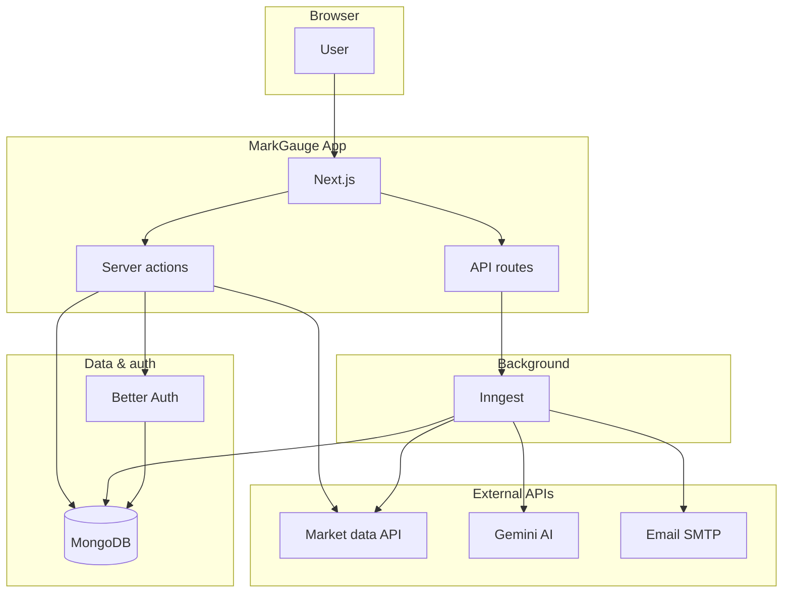

# External Services

Third-party integrations required for **MarkGauge** v1. Each service maps to functional requirements and non-functional constraints documented in sibling files. Selection favors managed or library-based options that fit a Next.js full-stack deployment without a dedicated ops team.

---

## Integration Overview



---

## Service Summary

| Service | Role | FR / NFR coverage | Required for v1 gate |
|---------|------|-------------------|:--------------------:|
| MongoDB | Persist watchlists, alerts, auth-linked data | FR-W*, FR-L*, NFR-D03 | ✓ |
| Better Auth | Sign-up, sign-in, session | FR-A*, NFR-S01–S03 | ✓ |
| Finnhub | Quotes, search, profile, news | FR-M*, FR-S*, FR-J02 | ✓ |
| Inngest | Scheduled alert checks, AI jobs | FR-J*, NFR-U04, NFR-C05 | ✓ |
| Nodemailer | Welcome and alert emails | FR-E*, NFR-R10 | ✓ |
| Gemini AI | Bounded news/market summaries | FR-I*, NFR-R07–R09 | Should have |
| TradingView (embed) | Interactive charts on stock detail | FR-S06 | ✓ (widget, no API key) |

---

## 1. MongoDB

### Purpose

Document database for user-scoped application data: watchlist rows, alert documents, and any collections required by the authentication adapter.

### Why this choice

- Flexible schema fits watchlist and alert models with minimal migration overhead
- Managed Atlas tier available for production with backups (NFR-D08)
- Mature Mongoose ODM integrates cleanly with Next.js server code

### Data stored

| Collection / area | Contents |
|-------------------|----------|
| Watchlist | `userId`, `symbol`, `company`, `addedAt` |
| Alerts | `userId`, `userEmail`, `symbol`, `company`, `alertName`, `alertType`, `threshold`, `isActive`, timestamps |
| Auth (via Better Auth) | User records and session storage per library schema |

### Environment variables

| Variable | Description |
|----------|-------------|
| `MONGODB_URI` | Connection string including database name |

### Operational notes

- Enable unique compound index on watchlist `(userId, symbol)`
- Index alerts on `userId`, `(userId, isActive)`, and `(symbol, alertType, isActive)` for job queries
- Use separate databases or URIs for development and production (NFR-E02)

### Alternatives considered

| Option | Why not v1 |
|--------|------------|
| PostgreSQL | Valid; document model sufficient and faster to iterate for this scope |
| SQLite | Weak fit for serverless multi-instance deploys |

---

## 2. Better Auth

### Purpose

Authentication and session management: registration, login, logout, and protected route integration.

### Why this choice

- TypeScript-first auth library designed for modern Next.js App Router
- Reduces custom session and cookie handling (NFR-S02, NFR-S03)
- Extensible for email-based credentials in v1

### Capabilities used

| Capability | MarkGauge use |
|------------|---------------|
| Email + password | Sign-up and sign-in forms |
| Session cookies | Header user menu, route protection |
| Server-side session check | Server actions and layouts |

### Environment variables

| Variable | Description |
|----------|-------------|
| `BETTER_AUTH_SECRET` | Signing secret for tokens/cookies |
| `BETTER_AUTH_URL` | Public app URL (e.g. `http://localhost:3000` in dev) |

### Operational notes

- Secret must be cryptographically random in production
- `BETTER_AUTH_URL` must match deployed origin to avoid cookie issues
- Welcome email triggered from sign-up server action after user creation (FR-A10)

### Alternatives considered

| Option | Why not v1 |
|--------|------------|
| NextAuth / Auth.js | Either viable; Better Auth selected for explicit App Router alignment |
| Clerk | Hosted auth adds cost and vendor lock-in for simple email auth |

---

## 3. Finnhub (Market Data)

### Purpose

Licensed market data for symbol search, live quotes, company profiles, and news feeds consumed by dashboard, stock detail, watchlist enrichment, and alert evaluation jobs.

### Why this choice

- REST API with clear endpoints for search, quote, profile, and company news
- Free tier suitable for development; paid tiers for production rate limits
- Broad US equity coverage aligned with v1 scope

### Endpoints used (conceptual)

| Operation | Typical endpoint pattern | Used by |
|-----------|-------------------------|---------|
| Symbol search | `/search?q=` | Search command |
| Quote | `/quote?symbol=` | Detail, watchlist, alert job |
| Company profile | `/stock/profile2?symbol=` | Stock detail |
| Company news | `/company-news?symbol=` | Watchlist news, AI context |

### Environment variables

| Variable | Description |
|----------|-------------|
| `FINNHUB_API_KEY` | Server-side API key |
| `NEXT_PUBLIC_FINNHUB_API_KEY` | Only if client-side widget requires (minimize exposure) |
| `FINNHUB_BASE_URL` | Default `https://finnhub.io/api/v1` |

### Rate limits & NFR alignment

- Centralize calls in server actions module (NFR-R01)
- Cache quotes per TTL (NFR-R02, `QUOTE_CACHE_TTL_SECONDS`)
- On HTTP 429, surface degradation (NFR-R04)
- Deduplicate symbol fetches in alert batch job (NFR-R05)

### Attribution

Display Finnhub attribution where license requires (NFR-L02).

### Alternatives considered

| Option | Why not v1 |
|--------|------------|
| Alpha Vantage | Lower rate limits on free tier for alert polling |
| Polygon.io | Strong but pricing steeper for hobby v1 |
| Yahoo unofficial APIs | No license reliability |

---

## 4. Inngest (Background Jobs)

### Purpose

Durable scheduled functions for price alert evaluation and optional AI summary generation without self-managed cron infrastructure.

### Why this choice

- Native Next.js route handler integration (`/api/inngest`)
- Retries, scheduling, and observability built in (NFR-D06, NFR-O02)
- Fits serverless deploy model on Vercel

### Functions (planned)

| Function | Trigger | Actions |
|----------|---------|---------|
| `check-price-alerts` | Cron (e.g. every 5 min) | Load active alerts → fetch quotes → trigger emails |
| `generate-market-summary` | Cron or event | Fetch news → call Gemini → store or email optional digest |

### Environment variables

| Variable | Description |
|----------|-------------|
| `INNGEST_EVENT_KEY` | Send events (if used) |
| `INNGEST_SIGNING_KEY` | Verify webhook signatures (NFR-S07) |

Inngest dev server runs locally for testing (NFR-E05).

### Operational notes

- Handlers must be idempotent (NFR-D01)
- Long-running AI steps should not block alert email path (NFR-R08)
- Manual trigger route `/api/trigger-alert` supports smoke tests

### Alternatives considered

| Option | Why not v1 |
|--------|------------|
| node-cron in long-running server | Poor fit for serverless; requires always-on process |
| Vercel Cron + API route | Viable; Inngest adds retry/dashboard with less custom code |
| BullMQ + Redis | Extra infrastructure to operate |

---

## 5. Nodemailer (Email)

### Purpose

Transactional email delivery: welcome message on registration and alert notifications when price rules trigger.

### Why this choice

- SMTP transport works with Gmail, SendGrid SMTP, Mailgun SMTP, and corporate relays
- HTML templates colocated in codebase for welcome and alert layouts
- No marketing ESP required for v1 transactional volume

### Email types

| Template | Trigger | FR |
|----------|---------|-----|
| Welcome | User registers | FR-E01 |
| Price alert | Alert job detects cross | FR-E02–E03 |

### Environment variables

| Variable | Description |
|----------|-------------|
| `NODEMAILER_EMAIL` | SMTP sender address |
| `NODEMAILER_PASSWORD` | SMTP password or app-specific password |

### Operational notes

- Use app passwords or dedicated SMTP credentials — never commit values
- Respect provider send limits (NFR-R10)
- Log send failures with alert id (NFR-D04)
- Optional AI paragraph appended to alert template (FR-E05)

### Alternatives considered

| Option | Why not v1 |
|--------|------------|
| Resend API | Excellent DX; SMTP via Nodemailer keeps dependency alignment with reference stack |
| AWS SES | More setup; overkill for early v1 |

---

## 6. Gemini AI (Google)

### Purpose

Generate short, bounded natural-language summaries from retrieved news and quote context for watchlist insight and enriched alert emails.

### Why this choice

- Strong summarization with competitive API pricing for low-volume personal alerts
- Official SDK for Node.js server environments
- Fits optional v1 pillar without blocking core alert path

### Usage constraints

| Constraint | Detail |
|------------|--------|
| Grounding | Prompts include only fetched news titles/snippets and numeric quote data |
| No advice | System instructions forbid buy/sell recommendations (NFR-L01, FR-I02) |
| Timeout | 30s max; failure omits summary (NFR-R08, FR-I04) |
| Cost | Token caps per request (NFR-R07) |

### Environment variables

| Variable | Description |
|----------|-------------|
| `GEMINI_API_KEY` | Google AI Studio / Vertex API key |

### Operational notes

- AI calls run inside Inngest functions or server actions — never expose key to browser
- Log latency and errors; do not log full prompt PII at info level in production

### Alternatives considered

| Option | Why not v1 |
|--------|------------|
| OpenAI | Viable swap; Gemini selected for reference stack alignment |
| No AI | Acceptable fallback; should-have for differentiation |

---

## 7. TradingView (Chart Embed)

### Purpose

Interactive price chart on stock detail pages without building a custom charting engine.

### Integration model

- Client-side widget script or iframe embed via hook component
- Symbol passed from route param (may map exchange prefix per provider conventions)
- No API key for basic embed; subject to TradingView terms of use

### NFR notes

- Lazy-load script on detail page only (NFR-P10)
- Widget failure shows static fallback message

This is an **embed dependency**, not a backend API integration.

---

## Environment Variable Checklist

Complete `.env.example` for implementation milestone:

```bash
# App
NODE_ENV=development
NEXT_PUBLIC_BASE_URL=http://localhost:3000

# Market data (Finnhub)
FINNHUB_API_KEY=
NEXT_PUBLIC_FINNHUB_API_KEY=
FINNHUB_BASE_URL=https://finnhub.io/api/v1

# Database
MONGODB_URI=

# Authentication (Better Auth)
BETTER_AUTH_SECRET=
BETTER_AUTH_URL=http://localhost:3000

# AI (Gemini)
GEMINI_API_KEY=

# Email (Nodemailer SMTP)
NODEMAILER_EMAIL=
NODEMAILER_PASSWORD=

# Background jobs (Inngest)
INNGEST_EVENT_KEY=
INNGEST_SIGNING_KEY=
```

---

## Dependency Risk Matrix

| Service | Risk if down | Mitigation |
|---------|--------------|------------|
| MongoDB | App cannot persist lists/alerts | Managed cluster, backups, health alerts |
| Better Auth | No login | Session errors surfaced; status page |
| Finnhub | No quotes; alerts skip | Cache, user-visible errors, job retry |
| Inngest | Alerts delay | Monitor job dashboard; manual trigger route |
| Nodemailer | No emails | Log failures; retry queue in job |
| Gemini | No AI summary only | Degrade to standard alert email |
| TradingView embed | Chart missing | Quote table still visible |

---

## Cost Posture (v1 Estimate)

| Service | Dev | Early production |
|---------|-----|------------------|
| MongoDB Atlas | Free tier | ~$0–25/mo |
| Finnhub | Free tier | Paid by call volume |
| Inngest | Free tier | Free–low tier |
| Gemini | Free tier credits | Usage-based |
| Nodemailer / SMTP | Free (Gmail app pwd) | Dedicated SMTP recommended |
| Vercel hosting | Hobby | Pro if needed |

Exact pricing tracked during implementation; architecture should allow provider swaps behind server modules.

---

## Related Documents

- [Functional requirements](functional-requirements.md)
- [Non-functional requirements](non-functional-requirements.md)
- [User flows](user-flows.md)
- [Feature checklist](feature-checklist.md)
- [Requirements index](README.md)
- [Discovery goals and scope](../discovery/goals-and-scope.md)
