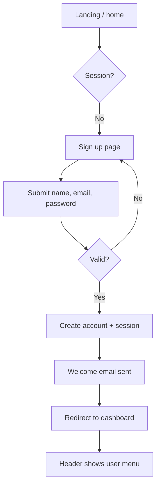
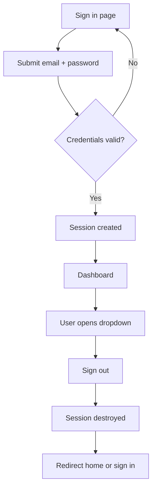
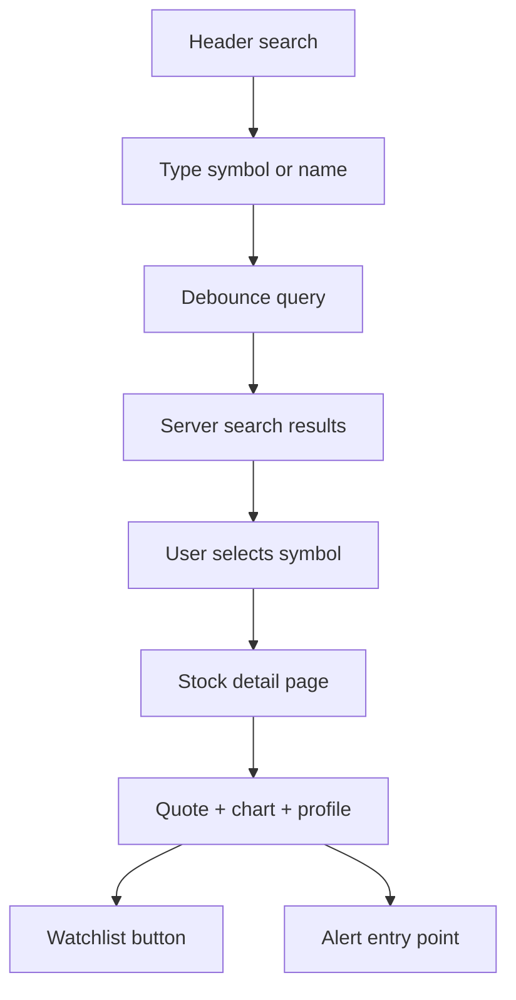
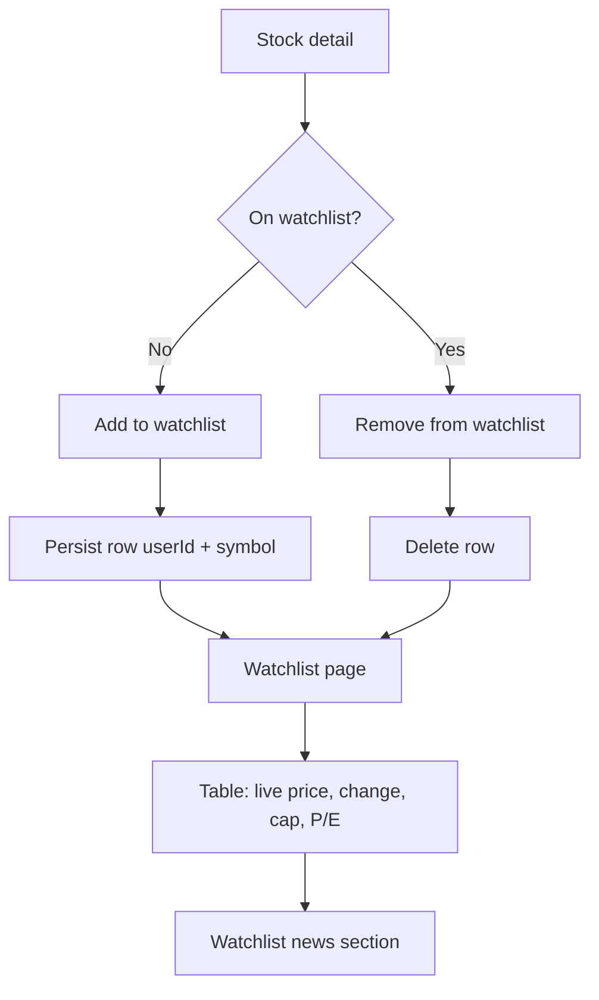
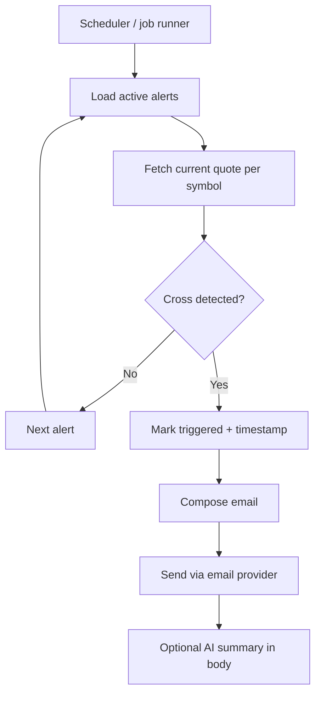
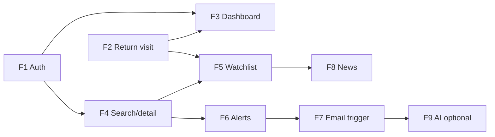

# User Flows

End-to-end journeys for **MarkGauge** v1. Flows map discovery personas and the anchor scenario to concrete screens, actors, and system steps. They feed functional requirements and the feature checklist in later documents.

**Conventions**

- **User** — signed-in or prospective account holder in the browser
- **System** — MarkGauge application and background workers
- **External** — market data API, email provider, optional AI service

---

## Flow Index

| ID | Flow | Priority | Persona fit |
|----|------|----------|-------------|
| F1 | Registration and first session | Critical | All |
| F2 | Sign in / sign out (returning user) | Critical | All |
| F3 | Browse market dashboard | Critical | Part-Time Monitor, Long-Term Holder |
| F4 | Search symbol and open detail | Critical | Active Trader |
| F5 | Watchlist add / remove / view | Critical | All |
| F6 | Create and manage price alert | Critical | Active Trader, Part-Time Monitor |
| F7 | Alert evaluation and email delivery | Critical | All (system-driven) |
| F8 | Watchlist-scoped news | Should have | Portfolio Enthusiast |
| F9 | AI insight summary (bounded) | Should have | Portfolio Enthusiast, Long-Term Holder |

---

## F1 — Registration and First Session

**Goal:** New user creates an account, lands on dashboard, and can reach watchlist and search without friction.

**Preconditions:** User is logged out; app is reachable.



| Step | Actor | Action | UI / system response |
|------|-------|--------|----------------------|
| 1 | User | Opens app root | Dashboard or auth redirect based on session |
| 2 | User | Navigates to sign up | Sign-up form: name, email, password, country |
| 3 | User | Submits valid form | Account created; session established |
| 4 | System | Sends welcome email | Transactional email with product greeting |
| 5 | System | Redirects authenticated user | Dashboard with market overview widgets |
| 6 | User | Explores nav | Home, watchlist, search available in header |

**Success criteria:** Session persists on refresh; welcome email received; protected routes accessible without re-auth.

**Failure paths:**

- Duplicate email → inline error on sign-up form
- Weak validation → field-level errors; no partial account
- Email send failure → account still created; log error (user not blocked from app)

---

## F2 — Sign In and Sign Out (Returning User)

**Goal:** Existing user resumes session; sign-out clears access to protected pages.



| Step | Actor | Action | UI / system response |
|------|-------|--------|----------------------|
| 1 | User | Opens sign in | Email and password fields |
| 2 | User | Submits credentials | On success, redirect to dashboard (or prior protected URL) |
| 3 | User | Opens user dropdown | Shows account label and sign out |
| 4 | User | Signs out | Session cleared; header shows sign in / sign up |
| 5 | User | Attempts watchlist while logged out | Redirect to sign in |

**Success criteria:** Invalid credentials do not leak whether email exists; protected routes require session.

---

## F3 — Browse Market Dashboard

**Goal:** User gets market pulse without configuring anything.

**Preconditions:** User signed in (v1 protected home).

| Step | Actor | Action | UI / system response |
|------|-------|--------|----------------------|
| 1 | User | Opens home / dashboard | Market overview layout loads |
| 2 | System | Fetches widget data | Indices, heatmap-style view, top stories via integrations |
| 3 | User | Scrolls widgets | Embedded third-party or API-driven blocks render |
| 4 | User | Clicks search or nav | Routes to search command or watchlist |

**Success criteria:** Dashboard loads in single session without manual refresh for initial paint; widget failures show fallback, not blank shell.

**Notes:** Dashboard is entry point for Part-Time Monitor persona; minimize configuration.

---

## F4 — Search Symbol and Open Detail

**Goal:** User finds a ticker and views quote, chart, and company context.



| Step | Actor | Action | UI / system response |
|------|-------|--------|----------------------|
| 1 | User | Opens search command / field | Focused search input |
| 2 | User | Types query (debounced) | Matching symbols and names listed |
| 3 | User | Selects result | Navigate to `/stocks/[symbol]` |
| 4 | System | Loads quote and profile | Price, change %, company summary |
| 5 | System | Renders chart widget | Interactive chart embed on detail page |
| 6 | User | Views watchlist control | Shows add or remove state for this symbol |

**Success criteria:** Unknown symbol → friendly not-found; API error → visible error state, no fake price.

---

## F5 — Watchlist Add, Remove, and View

**Goal:** User maintains a persistent symbol list with live fields.

**Entry points:** Stock detail watchlist button; watchlist page management.



| Step | Actor | Action | UI / system response |
|------|-------|--------|----------------------|
| 1 | User | Adds symbol from detail | Server action creates watchlist entry |
| 2 | User | Opens watchlist page | Table lists all user symbols |
| 3 | System | Enriches rows with quotes | Live price, change %, market cap, P/E where available |
| 4 | User | Removes symbol | Row deleted; detail button updates to add |
| 5 | User | Clicks symbol in table | Navigates to stock detail |

**Success criteria:** List survives logout/login; duplicate add prevented; empty state guides user to search.

**Business rules:**

- One watchlist per user in v1 (single list, multiple symbols)
- Symbol normalized to uppercase ticker
- User can only mutate own watchlist rows

---

## F6 — Create and Manage Price Alert

**Goal:** User defines a price rule and sees it listed as active until triggered or deleted.

**Entry points:** Stock detail page; alert modal / alert list UI.

| Step | Actor | Action | UI / system response |
|------|-------|--------|----------------------|
| 1 | User | Opens alert modal on symbol | Form: target price, condition above/below |
| 2 | User | Submits alert | Server validates symbol and numeric target |
| 3 | System | Persists alert document | Status `active`; linked to userId and symbol |
| 4 | User | Opens alert list | Active alerts shown with symbol and rule |
| 5 | User | Deletes alert | Removed from active checks |

**Success criteria:** Invalid price or missing symbol blocked client- and server-side; list reflects create/delete immediately after action.

**Business rules:**

- Condition enum: cross **above** or **below** target
- One alert row per user-defined rule (multiple alerts per symbol allowed)
- Triggered alerts move to triggered state (not deleted silently)

---

## F7 — Alert Evaluation and Email Delivery

**Goal:** Background process checks active alerts and notifies user when price crosses threshold.

**Actors:** System and External (market data API, email).



| Step | Actor | Action | System response |
|------|-------|--------|-----------------|
| 1 | System | Scheduled function runs | Batch or per-alert evaluation |
| 2 | System | Fetches latest quote | Respects API rate limits and cache |
| 3 | System | Compares price to rule | Above: price ≥ target; below: price ≤ target |
| 4 | System | On first trigger | Update status, set `triggeredAt` |
| 5 | System | Sends email | Subject/body include symbol, rule, price |
| 6 | User | Reads email | Can deep-link or manually open stock detail |

**Success criteria:** Email arrives within one check interval after cross; alert not re-fired repeatedly for same trigger (idempotent trigger handling).

**Failure paths:**

- Quote unavailable → skip or retry per policy; do not false-trigger
- Email send failure → log and retry; alert remains triggered or flagged for ops

---

## F8 — Watchlist-Scoped News

**Goal:** User reads headlines relevant to symbols on their list.

**Preconditions:** User has ≥1 watchlist symbol.

| Step | Actor | Action | UI / system response |
|------|-------|--------|----------------------|
| 1 | User | Opens watchlist page | News module below or beside table |
| 2 | System | Fetches news for watchlist symbols | Aggregated from market data API |
| 3 | User | Clicks headline | Opens external article or in-app link per design |

**Success criteria:** Empty watchlist hides news or shows onboarding hint; API failure shows empty state message.

---

## F9 — AI Insight Summary (Bounded)

**Goal:** Optional condensed context for watchlist or triggered alert, grounded in retrieved data.

| Step | Actor | Action | System response |
|------|-------|--------|-----------------|
| 1 | System | Job or on-demand trigger | Collect quotes + recent headlines for symbols |
| 2 | System | Calls AI with structured prompt | Summary text; no trade instructions |
| 3 | User | Views summary on watchlist or in email | Disclaimer: informational, not advice |

**Success criteria:** Summary references real fetched items; failure falls back to non-AI email body.

---

## Primary Journey — Anchor Flow (End to End)

Consolidates F1 → F3/F4 → F5 → F6 → F7 for acceptance testing.

```
Sign up → Dashboard browse → Search symbol → Stock detail
    → Add to watchlist → Open watchlist (verify row)
    → Create price alert → [wait for market cross]
    → Receive email → Return to app → Confirm on detail/watchlist
```

| # | User step | System responsibility |
|---|-----------|----------------------|
| 1 | Register | Auth, session, welcome email |
| 2 | Land on dashboard | Widget data load |
| 3 | Search and open symbol | Quote, chart, profile |
| 4 | Add to watchlist | Persist user-symbol row |
| 5 | Set alert above/below target | Persist active alert |
| 6 | (Passive) | Scheduled price check |
| 7 | Open email notification | Accurate symbol and price in body |
| 8 | Sign in again later | Same watchlist and alert history |

This journey is the **release gate** for v1 monitoring value.

---

## Route and Access Matrix

| Route / area | Logged out | Logged in |
|--------------|:----------:|:---------:|
| Sign up / sign in | ✓ | redirect to dashboard |
| Dashboard (home) | redirect to sign in | ✓ |
| Watchlist | redirect to sign in | ✓ |
| Stock detail | redirect to sign in | ✓ |
| API: alerts, jobs | server auth / keys | server auth / keys |

---

## Flow Dependencies



Auth (F1/F2) gates all personalized flows. Alert delivery (F7) depends on alert creation (F6) and market data. News (F8) depends on watchlist (F5).

---

## Open Questions (Resolve in Functional Spec)

| # | Question | Default for v1 |
|---|----------|----------------|
| 1 | Can logged-out users view any market page? | No — all main app routes protected |
| 2 | Re-trigger same alert after trigger? | No — user creates new alert |
| 3 | Alert check frequency | Fixed interval (e.g. 5 min); document in NFR |
| 4 | Deep link from email to symbol | Should have if route known |

---

## Related Documents

- [Competitor analysis](competitor-analysis.md)
- [Functional requirements](functional-requirements.md) *(upcoming)*
- [Non-functional requirements](non-functional-requirements.md) *(upcoming)*
- [External services](external-services.md) *(upcoming)*
- [Feature checklist](feature-checklist.md) *(upcoming)*
- [Discovery index](../discovery/README.md)
